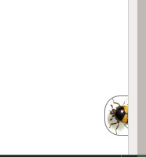

.. _user-interfaces:

User interfaces
***************

OpenBioMaps projects can be accessed through a web application and through
several external applications and programmatic interfaces. The web
application is the main interface for viewing, collecting, querying, and
managing project data. Depending on the configuration of a project and the
permissions of the current user, some of the interfaces described below may
not be available.

This page provides an overview of the main user interfaces. Detailed
instructions for configuring individual features are provided in the
corresponding administration and integration sections of the documentation.

Web application
===============

The OpenBioMaps web application provides access to project data and
project-specific tools. Its available pages and functions depend on the
configuration of the project, the installed modules, and the permissions of
the current user.

Login page
==========

The login page allows registered users to sign in to an OpenBioMaps server.
Depending on the server configuration, it may also provide options for
password recovery, registration, and authentication through an external
service.

Forgotten password
------------------

Users who have registered an email address can request a temporary login
link. The link is sent to the email address associated with their account.

Registration and joining a project
----------------------------------

In the default workflow, a user needs an invitation from an existing user
before joining an OpenBioMaps project. If public registration or
authentication through an external service is enabled on the server, a
different registration workflow may be available.

Where invitation requests are enabled, users can request access by following
the registration link on the login page. Project administrators receive
these requests. Depending on the project settings, the system may either
send an invitation automatically or wait for a project administrator to
approve the request and send one manually.

The invitation email contains a link for joining the project. During this
process, the user must:

* confirm that they want to join the project;
* accept the user agreement and the data processing declaration; and
* set a password.

The user may also be asked to provide additional profile information.

Profile page
============

The profile page provides access to personal settings and user-specific
content, including invitations, messages, saved upload states, and upload
history.

For more information about profile settings, see
:doc:`User profile <profile>`.

Invitations
-----------

By default, registered users can invite other people to join a project. The
invitation is sent in the language selected by the sender, and a personal
message can be added to the automatically generated invitation.

An invitation expires two weeks after it is sent. If the recipient does not
join the project before the invitation expires, a new invitation must be
sent.

By default, a user can have up to 11 active invitations within a project. A project 
administrator can change this limit in ``local_vars.php.inc``. If the limit
is set to ``0``, only project hosts can send invitations.

.. TODO: Confirm whether the invitation limit applies per user, per project,
   or across the entire server. Also confirm whether “project host” is the
   current name of this role in the user interface.

Messages
--------

OpenBioMaps projects include an internal messaging system for automated
notifications and messages exchanged between users. Users can choose on
their profile page whether messages should also be forwarded to their email
address.

The messaging interface can be opened from the profile page. It allows users
to search their messages and create new ones. Messages are organised into
the following categories:

* Personal Messages;
* Sent Messages;
* System Messages;
* Ratings and Comments; and
* News Feed.

Project administrators can send messages to groups of users and can also
send messages by email. Other users can send individual messages to one
another.

Client applications may also access the user's messages. For example, a
mobile application can notify users about messages from project
administrators or other users, as well as ratings and comments associated
with records they uploaded.

Creating a new project
----------------------

A registered user may be allowed to create a new database project. The
creator becomes the owner of the new project, which is independent of the
project from which it was created.

For instructions, see
:doc:`Creating a new OpenBioMaps project <new_project>`.

Project administration
======================

By default, project administration pages are available to the owner/founder of the
project. Other administrator users may also have access to administrative
functions.

Access to individual administration functions can be granted separately.
For example, a user may receive permission to manage upload forms, map
settings.

For an overview of the administration interface, see
:doc:`Project administration <admin_pages>`.

Map page
========

The map page displays the project’s spatial data and provides tools for 
spatial and attribute-based queries. It is available if the project contains 
spatial data (there is a geometric field in at least one PostgreSQL table 
belonging to the project) and the necessary database and MapServer settings 
have been configured (a query template has been defined, the MapServer mapfile 
layer has been set up, and the connection between the PostgreSQL server and 
MapServer has been established).

Depending on the project configuration, the map may display all accessible
records or only the results of the current query. Point, line, and polygon
data can be displayed in separate overlay layers.

A project can provide several base maps. OpenStreetMap is the default base
map, but grids, aerial imagery, sampling locations, or other
project-specific layers may also be available. Project administrators can
optionally configure a Google base map if the required Google account and
API settings are available.

Spatial queries
---------------

Users can start a spatial query by:

* drawing a geometry on the map;
* selecting a location with the map information tool; or
* selecting a previously loaded geometry.

A buffer can be applied to the selected or drawn geometry. For example, a
point query can include records within a 500-metre radius, while a line
query can include records within a 10-metre corridor.

The available drawing tools, query layers, and buffer options depend on the
project configuration.

Text and attribute queries
--------------------------

Projects can provide custom query fields for filtering records by their
attribute values. Depending on the field configuration, the available input
controls may include:

* text fields;
* autocomplete fields;
* single- or multiple-selection lists;
* date and time fields; and
* date interval selectors.

Spatial and attribute conditions can be used together when supported by the
project's query interface.

Saving and identifying queries
------------------------------

A query result can be stored on the server and assigned a persistent
identifier. A DOI may also be requested for eligible stored queries. Queries
can be saved so that they can be repeated later.

.. TODO: Explain the distinction between a saved query, a stored query
   result, a persistent keyword, and a DOI. The documentation should state
   whether repeating a query returns the original stored result or executes
   the query again against the current database contents.

Geometry tester
===============

The geometry tester is a separate map-based interface for inspecting and
editing geometries represented in formats such as JSON and WKT. It can also
be used with geometries obtained through OpenStreetMap requests.

.. TODO: Describe where the geometry tester can be opened, which geometry
   formats and JSON variants it supports, what “OSM calls” means, and whether
   edited geometries can be exported or transferred directly to another
   OpenBioMaps interface.

Data upload page
================

The data upload page is used to prepare, validate, and submit records to a
project database.

A project can define multiple upload forms for the same database table.
Each form can expose different fields, validation rules, input controls, and
upload options. For example, one form may be designed for public data
submission, while another may be optimised for a mobile application or a
particular import format.

For information about creating and configuring forms, see
:doc:`Upload form management <upload_forms>`.

File upload
-----------

The upload interface supports the following types of files:

* delimited and structured text files: CSV, DSV, TSV, and JSON;
* images: JPEG and TIFF, including supported Exif metadata;
* spreadsheets: ODS, XLS, and XLSX;
* spatial data: ESRI Shapefile components, GPX, and SQLite files; and
* genetic sequence data: FASTA.

An ESRI Shapefile upload may consist of the related ``.shp``, ``.dbf``,
``.cpg``, ``.prj``, and ``.shx`` files.

Supported files can also be imported from a URL using an HTTP GET request.

.. TODO: Document the accepted JSON structure, delimiter and character
   encoding rules for text files, supported Exif fields, and the required
   structure of SQLite files. It should also be explained how multi-file
   Shapefiles are selected or packaged for upload.

.. TODO: Clarify whether URL imports support HTTPS, authentication,
   redirects, and URL parameters, and whether server-side restrictions are
   applied to remote URLs.

Web form entry
--------------

Web forms allow users to create records directly in the project web
interface. The data entry table works similarly to a spreadsheet: database
fields are displayed as columns and records are entered as rows.

Although the table can contain an arbitrary number of rows, it is primarily
intended for entering a few dozen or, at most, a few hundred records. For
larger datasets, preparing a spreadsheet and using the file upload interface
is recommended.

Required field headers are displayed in red, while optional field headers
are displayed in grey. A yellow input area below each field header can be
used to fill multiple rows with the same value.

The interface also provides tools for applying bulk changes, formatting or
transforming column values, and excluding rows from the upload.

.. TODO: Describe the available bulk-editing, formatting, and transformation
   functions. It should also be clarified whether an excluded row remains in
   the saved upload state and can later be restored.

Validating and preparing data
-----------------------------

Before records are submitted, the uploaded or manually entered data can be
reviewed and corrected in the upload table. The available validation and
editing tools depend on the upload form and its configured fields.

At any stage of this preparation process, the current contents of the upload
table can be exported as a CSV file.

Saving and resuming an upload
-----------------------------

Preparing a large upload may take considerable time, and the connection to
the server may be interrupted before the records are submitted. To prevent
the prepared data from being lost, the current state of the upload table can
be saved and restored later.

The system also creates an automatic backup approximately every two minutes.
Saved and automatically backed-up upload tables are available from the
profile page, where obsolete backups can be deleted.

.. TODO: Clarify the difference between a manually saved upload state and an
   automatic backup. The retention period, storage limits, access rules, and
   conditions under which automatic backups are deleted should also be
   documented.

Upload history
--------------

Metadata about each completed data upload is recorded automatically. Users
can access upload history from their profile page and from the datasheet of
an uploaded record.

.. TODO: List the metadata stored for an upload, explain who can view it, and
   describe how an upload-history entry is related to individual records.

External data submission interfaces
-----------------------------------

Data can also be submitted from external applications. Depending on the
project configuration and the permissions of the user, this may include:

* API clients;
* mobile data collection applications;
* the OpenBioMaps R package; and
* applications using an authorised SQL connection.

For more information, see:

* :doc:`OpenBioMaps API <api>`;
* :doc:`Client applications <clients>`; and
* :doc:`Mobile applications <mobile_applications>`.

Datasheet page
==============

Each database record has a datasheet containing its data fields and
associated metadata. The fields and metadata visible to a user may be
restricted by project settings and access rules.

.. TODO: Explain how users open a datasheet, which metadata categories it
   contains, and which project settings or access rules control the visible
   content.

Data history
------------

A record's data history shows changes made to that record. This page is
available only if the project host has enabled change logging in the project
settings.

.. TODO: Document which operations are recorded, whether previous field
   values and the identity of the editor are displayed, who can access the
   history, and whether changes can be reverted.

Database summary page
=====================

Each project includes a database summary page containing a description of
the project and its contact details.

.. TODO: Describe where the database summary page is available and identify
   the administrative settings from which its content is obtained. It should
   also be clarified whether the page contains additional metadata, access
   conditions, or citation information.

Welcome page
============

Each project can provide a configurable welcome page. It can be used to
introduce the project and direct users to its most important tools and
information.

For more information, see
:doc:`Configuring the welcome page <welcome_page>`.

Other user interfaces
=====================

In addition to the web application, OpenBioMaps data and services can be
accessed through mobile applications, desktop GIS software, statistical
software, and custom API clients. The interfaces available for a particular
project depend on its configuration and access rules.

Mobile applications
-------------------

Mobile applications can support field data collection and communication
with OpenBioMaps projects. The available features depend on the application
and the project's upload forms and permissions.

For more information, see
:doc:`Mobile applications <mobile_applications>`.

QGIS
----

The OpenBioMaps QGIS plugin provides access to OpenBioMaps data from QGIS.
Projects may also provide authorised SQL connections for workflows that
require direct database access.

For more information about supported client integrations, see
:doc:`Client applications <clients>`.

R
-

The ``obm`` R package provides tools for querying and working with
OpenBioMaps data from R.

`obm on CRAN <https://cran.r-project.org/web/packages/obm/index.html>`_

API clients
-----------

The OpenBioMaps API allows authorised applications and scripts to query or
submit project data. The available operations depend on the API endpoint,
project configuration, and permissions of the authenticated user.

For more information, see
:doc:`OpenBioMaps API <api>`.

Error reporting
===============

Where error reporting has been configured on the server, the bug-reporting
interface is available from the profile page and the data upload page.
Selecting the bug icon in the bottom-right corner of the screen opens a
simple report form.

   Bug-report icon in the bottom-right corner of the page

.. figure:: images/hiba_2.jpg
   :scale: 100 %
   :alt: Error-reporting form

   Error-reporting form

Reports from the official OpenBioMaps services can be forwarded to the
`OpenBioMaps issue tracker
<https://gitlab.com/groups/openbiomaps/-/issues>`_. The user may receive
automated system messages when subsequent events occur in relation to the
report.

A server administrator can enable an error-reporting service by configuring
the ``AUTO_BUGREPORT_ADDRESS`` variable in ``system_vars.php.inc``. Servers
maintained by the OpenBioMaps Consortium can use a value supplied by the
Consortium. Administrators of other servers must provide and configure
their own compatible issue tracker.

.. TODO: Confirm the exact behaviour and expected value of
   ``AUTO_BUGREPORT_ADDRESS``. It should be documented whether reports are
   always sent to GitLab, what information is included automatically, how
   authentication is handled, and how users receive updates about their
   reports.
