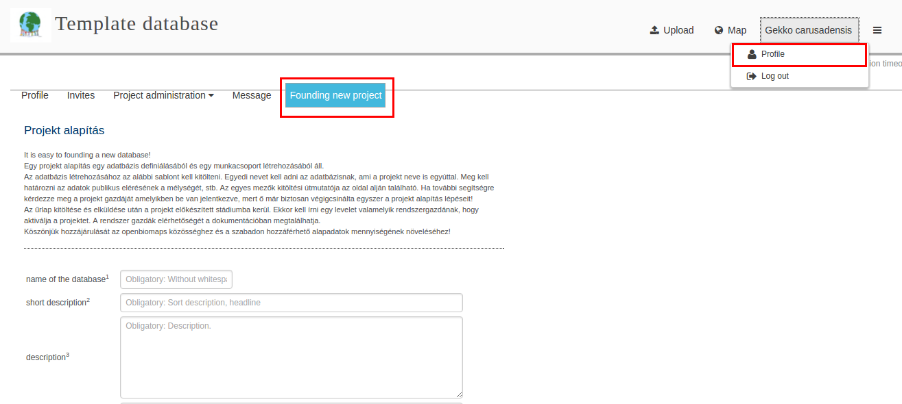
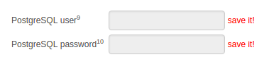
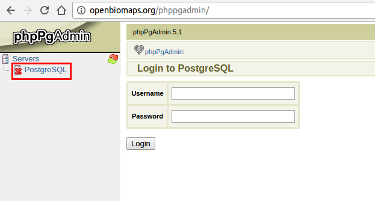
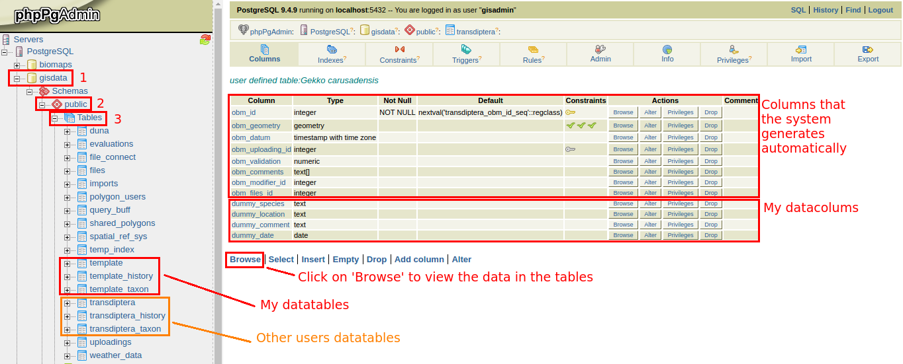

User interfaces
***************

Log in
======

This button moves you to the "sign in" surface. If you already signed user you can use your own account. If not, you can ask invitation across the "registration" button.

Registration

Lost password

Loged-in surface
================
After login you will see your profile. See details about functions and features in the following link: :ref:`profile`

That surface is divided to three main part: Main headline, sub-headline and working surface (see in Fig 1.).

   Fig 1. The loged-in surface.

You can see in the sub-headline gear-wheels, if you click on them several button will appear between the main- and sub-headline: Profile, Invites, Project administration, Messages, Founding new project (see in Fig 2.).

.. figure::  images/img_8.png
   :align:   center

   Fig 2. The loged-in surface after you clicked on the gear-wheels.

Profile
-------
See: :ref:`profile`

Invites
-------
See: :ref:`invitations`

Project administration
----------------------
See: :ref:`project_administration`

Messages
--------
Across this feature you can send e-mail to the users of the database.

Founding new a project
======================
.. sectionauthor:: Róbert Veres (2016-12-19)

Introduction
------------
Most of the steps will be illustrated with screenshots, and I will also include a few code lines which I used in SQL and the Debian terminal. 
Even tough, in-depth SQL programming knowledge isn't required to follow the steps of founding a database, some basic knowledge is recommended for a better understanding of the OBM system.
The operating system that I'm using, is Ubuntu (Linux), but you should be able to follow along. 
If you have any questions regarding the discussed topics, or things I didn't covered, you can ask them on the official OBM forums or on one of the developers [mailing lists](http://openbiomaps.org/community/?lang=en) (if you are new to OBM, the Biomaps mailing list is probably the best option).

There will be several updates to this manual, and new topics will be added, based on request or big system changes/updates. These changes will be listed in the last chapter of the manual.

Creating a database
-------------------
In this chapter I will focus on walking you trough the steps required, to found your own database.

To be able to create a database, firs you need an invitation, from someone who is already an OBM user. If you don't have such an acquaintance, you can simply request one using the mailing list's mentioned in the previous chapter. If you receive an invitation, you will be able to register, and become an OBM user.

If you have done the previous step, you will be able to access your profile, after you login (Fig.3).

   Fig 3.

Here, on the **Founding new project** tab, you will find the creation form which you will have to fill out. If for you, the text doesn't appear in english, don't panic. At the bottom of the page, you can choose the language in which the text appears. Each field has a tooltip, in which essential information is displayed about the respective field. E.g in the first field, you can see that is is obligatory to compleat, it cannot contain whitespaces, and can contain lowercase letters only (it can however contain underscores). You have a full list of descriptions regarding the fields, at the bottom of the page.

Please note, that the *'short description'* will be the public headline of the database, while the *'name of the database'* is a definition that the code uses and it's not public. It is good practice, to add a detailed *'Long description'*, when completing the *'data fields'* section (this is not obligatory by default). Another thing to note is, that when choosing the *'type'* in the *'data fields'* section, the difference between numeric and integer type is, that the numeric type can be a decimal number while the integer must be a whole number; and the difference between text and string type is, that the text can have an unlimited number of characters while the string can have a maximum of 255 characters.

At this point, if you configured everything correctly, upon clicking on the create button, a window should pop up with a success message and a log of all the created files. You should read the log, as it contains instructions on what to do next with your project. The project will now be available at *'openbiomaps.org/biomaps/projects/YOUR_NEW_DATABASE'*.

Configuring your database
-------------------------
When you found a new project, the system create a skeleton, which has three parts:
  * A directory tree in the file system (/var/www/html/biomaps/projects/YOUR_NEW_DATABASE), which is containing symlinks to the program files and local setting files (local_vars.php.inc .htaccess)
  * A postgresql user (the postgresql, is the type of SQL our system uses) for the new project that has authorisation to access all necessary tables (the ones mentioned below, and other temporary ones). These information's (the *'PostgreSQL user'* and *'PostgreSQL password'*) are generated automatically and you should save them, because you will need them to access your data tables for administration purposes. Fig.2
  * 3 tables within the **gisdata** database (this is where all the data tables are stored):
    * YOUR_NEW_DATABASE (by default this will contain all the data that you will store in your project)
    * YOUR_NEW_DATABASE_history (as the name implies, this will contain a list of changes that have occurred in your YOUR_NEW_DATABASE table)
    * YOUR_NEW_DATABASE_taxon (this table will be generated automatically; i will speak about this table in more detail later)
    * You can access all your data tables at http://openbiomaps.org/phppgadmin/ While you can see the data tables of other OBM users, you can only access your own. Fig.3 - Fig.4. Note, that you are not limited to these 3 tables, and can create new ones. It is good practice to follow the naming pattern. Accordingly the new table should look like *'YOUR_NEW_DATABASE_new_table_name'*.

   Fig 2.

   Fig 3.

   Fig 4.

At this point you have a valid project, but this is not sufficient to start working with the new database. Additional settings have to be made in order to connect the SQL tables to the **Mapserver**, and let the **web application** use both your tables and the Mapserver. The configurations should be made in the following order: **Database -> SQL queries -> Openlayers -> Mapserver**. All these changes must be done in the online interface of your project (Profile -> **Project administration** tab).

Database
--------
First, you must "pick-up" your database columns (Profile -> Project administration -> **Database columns** tab) The OBM does not handle this step automatically. The chosen columns have to be marked for identity and type of use. They have to be provided with public names (these can be the same as the database column names or different: e.g *'dummy_date'* ->  *'Dummy date'*) and must be marked as *'special column'* or *'common data'*. You cannot change the public names of the automatically generated columns, like *'obm_geometry'* or *'obm_id'*. The *'special columns'* are the special column types, that project users use a lot, and you will have a few extra options for the columns marked with thees types. Some of the types are: **date** type, different **geometry** types (which handles one ore more sets of coordinates), **species** type (you will want to mark the column containing species names with this one, because it will register the names, and store them in the YOUR_NEW_DATABASE_taxon table, which we will set up a little later. If this is set up correctly, the map search engine will offer option from the table, as you start typing in search fields), the **number of individuals** and **citing person** types. Note, that you can have only one of each of the special column type (except the *'date'* and *'cite person'* types), and the rest of the columns should be set to *'common data'*. Every column that you wish to use, must be "picked-up", because the system will not have access to the one's that aren't. If you add new databases later, or expends the existing ones with additional columns, these have to be "picked up" again the same way. One of the columns, that the system generates automatically will appear here. This is the obm_id column. Usually you don't want this column to be public, and it is very important to set this column's type to *'special: id'*. Only after setting the type, will the web page be able to work with the data from your data tables. Fig.5

   Fig 5.

SQL queries
-----------
Second, a number of SQL queries need to be made for the Mapserver and web application (Profile -> Project administration -> **SQL query settings** tab). In most of the cases, if you have simple data structure, only one data layer (simple collection data) and one user access level (no login restriction) in your new project, you will need to set up one query for the map visualisation (*'layer_data_points'*) and another for the query data(*'layer_query_points'*); in total 2 queries for the 2 layers, which are both public. **"Base type"** queries will only be used by the Mapserver but **"query type"** queries will be used by both the Mapserver and the web application. These queries can be accessed by their names (the defaults, these are **"layer_data"** and **"layer_query"**).

In my example, I will have user restriction levels (you will have access to more detailed data if you are logged in), and so I will need a total of 4 queries, 2 for the Mapserver (one public, and one private) and 2 for the web applications (one public, and one private). Note, that when configuring the query layer, you will need to specify the type of geometry that you are using. In my case the geometry type is point, and I will name my layers *'layer_data_points'* and *'layer_query_points'*. If you have a simple data structure, you can go ahead, and use the queries automatically generated by the system. In case you need some more complex queries, you can always ask for help on the forums, or official mailing lists.
Note, that the system can only register the changes made in one line at a time, so each change that you make, must be saved independently by clicking the **modify it** button. Also, don't worry about the red warning text; we will fix it in the next step. 

Mi a web map layer? Meg kiegesziteni plusz informacioval.

Fig 6.

   Fig 6.

OpenLayers
----------
In the next step, the access for Openlayers to Mapserver layers must be set up, through the names defined in the previous step (in my case these were *'layer_data_points'* and *'layer_query_points'*). This can be found under Profile -> Project administration -> **Web map layers** tab. This step is easy, because if we set up everything correctly int he previous step, the system dose everything for us. Also, because we already defined the names of the layers, we can just click the add button and everything is done. Note, that because we have 2 layers, we need to add both of them to the definition. Upon adding the firs layer, the second one is also generated automatically. Upon finishing this step, you return to the previous tab, you can see that the red warning message is gone. Fig.7

Mapserver
---------
In the final step, the mapfile (private) has to be checked, and @@extent@@ needs to be replaced with the corresponding real values (Profile -> Project administration -> **Mapserver settings** tab). For More information about the EXTENT see here: http://mapserver.org/mapfile/map.html . Shortly..., ide kel egy rovid leiras.

E.g.: Romania's box is: 20.2155838012695 43.5630531311035 29.9736919403076 48.400691986084

Fig.8

Fine tunning steps and bug trackings
------------------------------------
- Check your settings -> if the map is not pink that is a good sign.
- Create an upload form & upload some data.
- Go to the phppgadmin interface gisdata/YOUR_NEW_DATABASE and use the analyse function of postgresql
- Go back the mapserver settings to see your calculated bounding box of your data. This can be copied/pasted as EXTENT .....
- Query the records & check the results

Any errors made in the steps above will cause pink squares on the map window.

Reading the web server, syslog and the mapserver log will help resolve these problems: 
tail -f /var/log/apache2/error.log 
tail -f /var/log/syslog OR /var/log/openbiomaps.log
tail -f /tmp/YOUR_NEW_DATABASE_private_ms_error.txt)

At the bottom of the 'Administrative menu' in the logs page you can read the openbiomaps.log and the mapserver log files.

Map page
========

map query
---------

text query
----------

save query
----------

share query
-----------

Upload data
===========

File upload
-----------

Web upload
----------

Saved uploads
-------------
