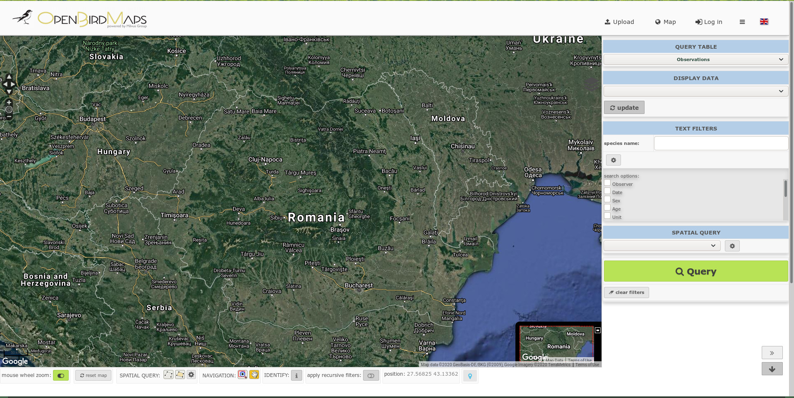
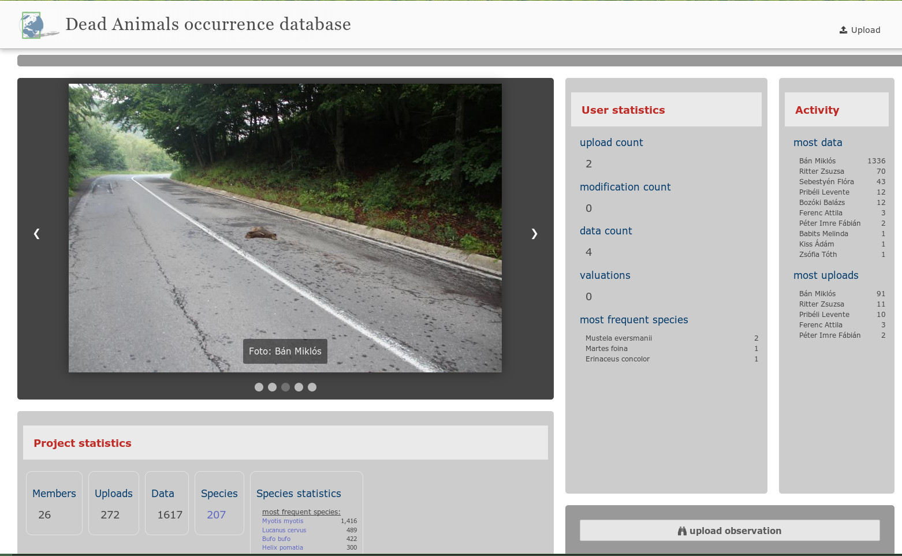

Opening page
============
We can create custom opening pages for projects. 
There are templates and pre-made functions for this, but in fact, this landing page can be any custom website.
By default, a template called *gridbox* is loaded, which itself can be customised.
We can configure the landing page in the local_vars.php.inc file.
If the LOGINPAGE variable is set to mainpage, the main page template configured in the MAINPAGE variable will be loaded.

.. code-block:: php

  define('MAINPAGE',array(
    //'custom_skeleton'=>1,
    'template'=>'gridbox', //intropage
    'content1'=>'map',   // map | upload-table | slideshow
    'sidebar1'=>'column_something.project|custom_countries|members|uploads|data|species|species_stat|hotlinks', // members uploads data species species_stat
    'system_footer'=>'on',
    'system_header'=>'off',
    //'restrictaded_pages'=>array('map','id','history','profile','data','table','editrecord','qtable','query','show','LQ','metadata')
  ));

Here are some screenshot examples from different projects:

   
   No separate landing page is set

.. figure:: images/nyitolap_2.jpg
   :scale: 50 %
   :alt: boxed landing page
   
   with map on main site

   
   with image gallery in main location

.. figure:: images/nyitolap_4.jpg
   :scale: 50 %
   :alt: boxed landing page
   
   Full screen with slide-in image gallery

.. figure:: images/nyitolap_5.jpg
   :scale: 50 %
   :alt: boxed landing page
   
   More boxed landing pages with upload history in the main location

.. figure:: images/nyitolap_6.jpg
   :scale: 50 %
   :alt: map landing page leaflet with map
   
   Project embedded in a landing page interface

