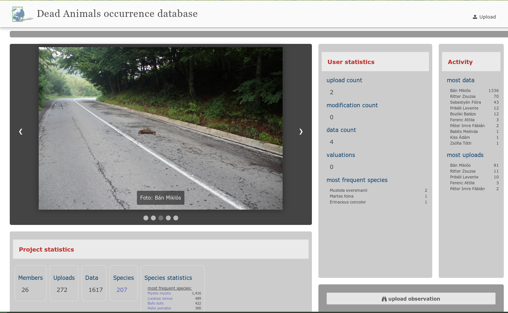
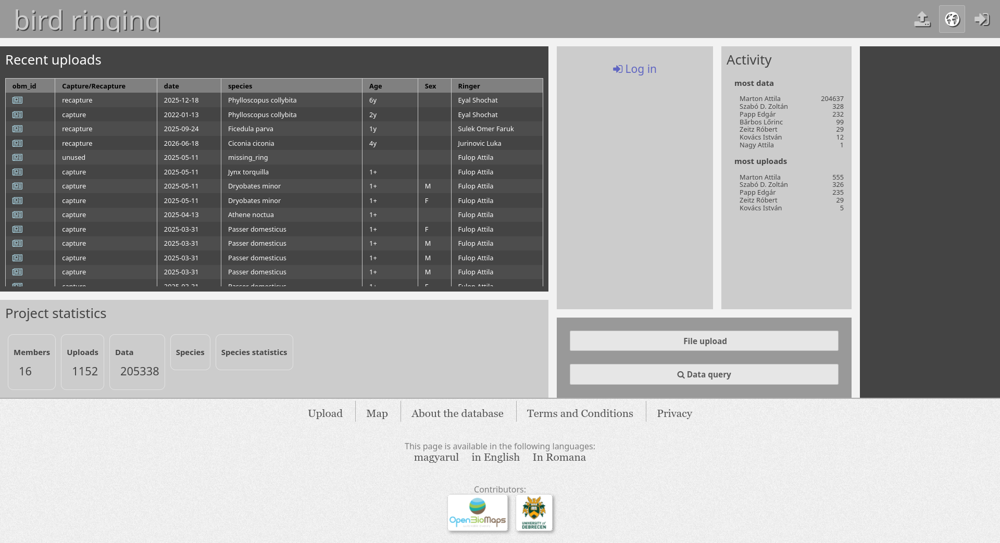
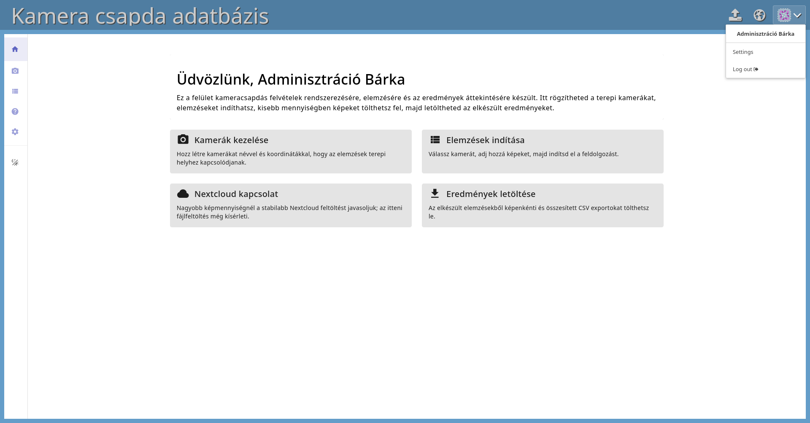
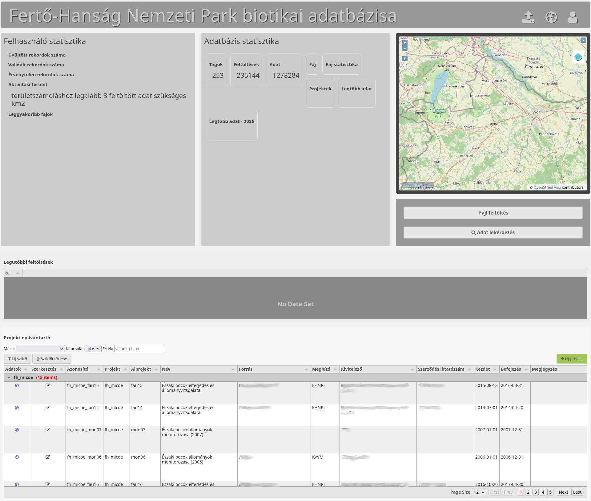

Landing pages
=============

OpenBioMaps projects can use a customised landing page. Three approaches are
available:

* the built-in main page;
* an independent custom page application; or
* a single-page application installed as a module.

The appropriate option depends on how much customisation the project requires.
The built-in main page is suitable for common layouts, while a custom page or
a single-page application can provide a fully customised interface.

.. TODO:  Érdemes pontosan megadni a main page editor és a custom page adminisztrációs oldal menüútvonalát.                                                                          
   Jó lenne felsorolni a MAINPAGE támogatott sablonjait és konfigurációs kulcsait.                                                                                            
   A custom page alkalmazás létrehozásához hasznos lenne egy minimális HTML/JavaScript-példa.                                                                                 
   Pontosítani kellene, melyik routerfájlt és milyen módon kell módosítani SPA használatakor.                                                                                 
   Dokumentálni kellene, hogy a custom page és az SPA hogyan fér hozzá az OpenBioMaps API-hoz és a bejelentkezett felhasználó munkamenetéhez.                                 
   Érdemes biztonsági útmutatást adni a hozzáférés-vezérlésről, a külső JavaScript-függőségekről és a tartalombiztonsági szabályokról.                                        
   Ellenőrizni kell, hogy a nyitolap_7.jpg, nyitolap_8.jpg és nyitolap_9.jpg képfájlok ténylegesen megtalálhatók-e a dokumentáció images könyvtárában.                        
   Hasznos lenne minden képnél feltüntetni, hogy a három megoldás közül melyiket és milyen lényeges beállításokat mutatja. 

Built-in main page
------------------

The built-in main page can be configured through the main page editor in the
project administration interface. Low-level settings can also be configured
in the project's ``local_vars.php.inc`` file.

To use it as the landing page, set ``LOGINPAGE`` to ``mainpage``. OpenBioMaps
will then load the main page template configured by ``MAINPAGE``.

See the :doc:`server installation guide <server_install>` for example
``local_vars.php.inc`` settings, including the available ``LOGINPAGE`` and
``MAINPAGE`` values.

Whenever possible, use the project administration interface instead of
editing ``local_vars.php.inc`` directly. Direct configuration changes should
be made by a server administrator and tested before they are deployed to
users.

Custom page application
-----------------------

A project can also use a complete, independent application as its landing
page. OpenBioMaps refers to this type of application as a custom page. Custom
pages can be configured through their project administration pages.

A custom page is typically implemented with HTML, CSS, and JavaScript. It can
use a JavaScript framework such as Vue.js or Alpine.js, but a framework is not
required. The implementation should remain compatible with the project's
authentication, authorisation, and deployment environment.

Before publishing a custom page, verify that it works for both authenticated
and unauthenticated visitors, according to the project's access rules. It
should also be tested on the screen sizes and browsers used by the project's
target audience.

Single-page application
-----------------------

The third option is a single-page application (SPA) installed through the
single-page application module. To use an SPA as the project's landing page,
the project router must be configured to direct the landing-page route to the
application.

Router changes affect how project URLs are handled and should therefore be
performed by a developer or server administrator. Test direct navigation,
page refreshes, authentication redirects, and browser back and forward
navigation after changing the routing configuration.

See the :doc:`module documentation <modules>` for more information about
single-page applications and other OpenBioMaps modules.

Choosing an approach
--------------------

Consider the following when selecting a landing-page implementation:

* Use the built-in main page when its templates and configurable components
  meet the project's requirements.
* Use a custom page when the project needs a specialised page but does not
  require a complete client-side application.
* Use an SPA when the landing page requires complex client-side navigation,
  state management, or application-specific interactions.
* Prefer the simplest option that meets the requirements, as custom
  applications require ongoing development, security updates, and browser
  compatibility testing.

After configuring a landing page, verify that:

* it loads at the expected project URL;
* login and logout redirects work correctly;
* links to OpenBioMaps pages use the correct project path;
* access restrictions are enforced;
* the page works on mobile and desktop devices;
* images and other static resources load correctly; and
* useful content remains available when JavaScript or an external service
  fails, where practical.

Examples
--------

The following screenshots show landing pages used by different projects.

.. figure:: images/nyitolap_1.jpg
   :scale: 50 %
   :alt: A single-page application used as a project landing page

   Single-page application used as a landing page.

.. figure:: images/nyitolap_2.jpg
   :scale: 50 %
   :alt: Built-in landing page with a map

   Built-in landing page with basic settings and a map.

   Built-in landing page with an image gallery.

.. figure:: images/nyitolap_4.jpg
   :scale: 50 %
   :alt: Full-screen landing page with a slide-in image gallery

   Full-screen landing page with a slide-in image gallery.

   Built-in landing page with basic settings and a custom summary table.

.. figure:: images/nyitolap_6.jpg
   :scale: 50 %
   :alt: Project map embedded in a landing-page interface

   Project map embedded in a landing-page interface.

.. figure:: images/nyitolap_7.jpg
   :scale: 50 %
   :alt: A single-page application used as a project landing page

   Single-page application used as a landing page.

   Single-page application used as a landing page.

   Built-in landing page with an integrated custom project-management
   application.
