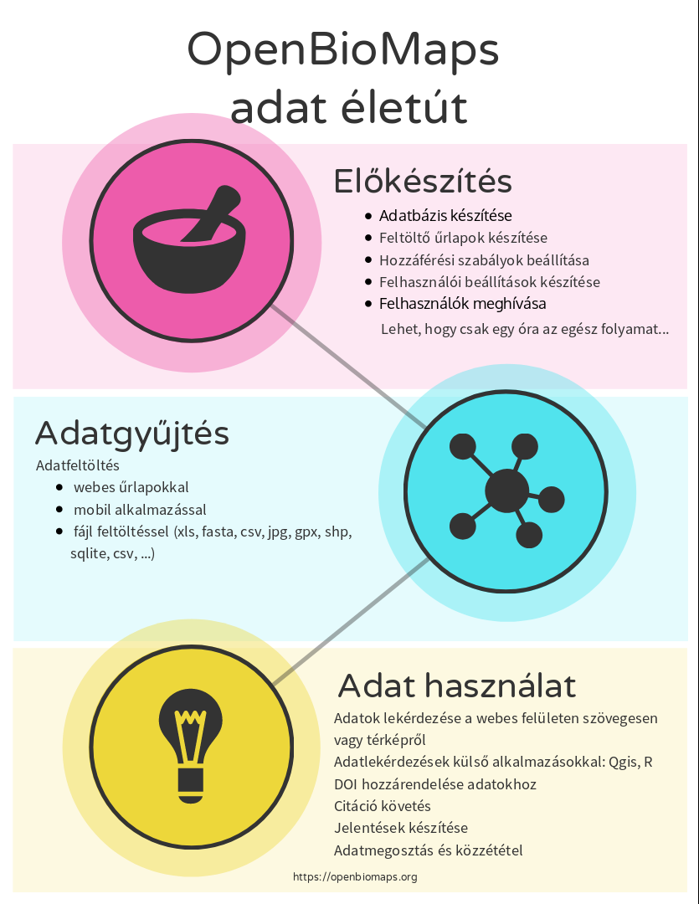

Bevezetés
*********

**Az OpenBioMaps projektnek két fő célja van**

    *  ingyenes és szabadon hozzáférhető biológiai, térképi adatbázis szolgáltatás fenntartása,
    *  és ezen szolgáltatás mögötti nyílt forráskódú szabadon felhasználható szoftveres eszközök fejlesztése
    
**Az OpenBioMaps fontos tulajdonságai**

   * Az OpenBioMaps minden szolgáltatása ingyenesen vehető igénybe.
   * Az OpenBioMaps célja élő szervezetekre vonatkozó (természetvédelmi jelentőségű vagy biodiverzitás kutatásban használható) előfordulási és az ahhoz kapcsolódó adatok (biotikai adatok) nyilvántartása.
   * Az OpenBioMaps kifejezett célja a felsőfokú oktatás támogatása és a kutatás és természetvédelem kapcsolatának erősítése.
   * Az OpenBioMaps nyílt forráskódú alkalmazásokra támaszkodó, decentralizált, minimalizált költségigényű, központi ellenőrzés nélküli részadatbázisokból álló adatbázis és keretrendszer.
   * Az OpenBioMaps elsődleges célközönsége a természettudományos és természetvédelmi szakma, valamint a környezetügyet is érintő tervek, stratégiák, döntések előkészítői.
   * Tetszőleges struktúrájú és szabályozású adatbázisok létrehozása és kezelése a felhasználók által.
   * Egyszerű adat feltöltés különböző fájl formátumokból (ods, xls, xlsx, gpx, shp, csv ...).
   * Ismételhető és idézhető lekérdezések.
   * Tartós azonosítok használata (DOI) adatbázisokhoz és lekérdezésekhez is.
   * Az adatok kölönböző formátumokban letölthetőek (shp, csv, gpx, json, ...)
   * Az adatok elérhetőek távoli adatbázisokból vagy asztali alkalmazásokból is (pl.: R, QGIS).
   * Integrálható szolgáltatások.
   * Adatkapcsolatok más adatbázisokkal.
   * Személyre szabható adat feltöltő felületek létrehozása.
   * Terepi mobil adatgyűjtő alkalmazás.
   * Közösségi szerkesztésű dokumentáció.
   * Bármilyen nyelvre fordítható felület (jelenleg Magyar, Angol, Román és részben Orosz)
   * Közösségi visszajelzéseken alapuló fejlesztés.

OpenBioMaps folyamatok
======================

Az OBM megpróbál támogatást adni a teljes adat életútra, az adatgyűjtéstől a rendszerezésen át a felhasználásig.

OpenBioMaps Konzorcium
======================
:download:`OpenBioMaps Konzorcium Szerződés<docs/consortium_2015.pdf>`

