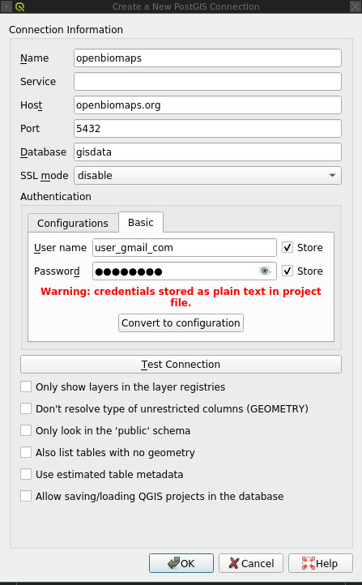

A modulok egyedi igény szerint bekapcsolható kiterjesztései az OpenBioMaps webes alkalmazásnak. Vannak projekt szinten érvényesülő modulok (pl.: postgres felhazsnáló készítése, fotó kezelő) és vannak egyes adattáblákhoz kötődő modulok is (pl.: szöveges szűrők térképi oldalhoz, CSV export).

A modulok használata különböző felhasználókhoz vagy felhasználói csoportokhoz rendelhetők.

A modulok az alkalmazásban modul horgok kapcsolódnak, amelyek többnyire a térkép oldalon és profil lapon helyezkednek el.
A legtöbb modul egyszerű paraméterekkel konfigurálható (JSON), de egyes modulok egyéni adminisztratív felülettel rendelkeznek.


Modul adminisztráció
====================
A *projekt_adminisztráció -> modulok* oldalon lehet engedélyezni és konfigurálni a modulokat.

Modul hozzáadása
----------------
Saját modulokat tölthetünk fel és ezeket hozzáadhatjuk a projektünkhöz. A modul fejlesztéshez nézd meg az modules/examples/ könyvtárban a példa modulokat.

Modul hozzáférés beállítások
----------------------------
Az egyes modulokat akár többször is hozzáadhatjuk a listánkhoz. Ez lehetővé teszi számunkra, hogy az egyes modulokhoz többféle hozzáférést adjunk meg. Ez azoknál a moduloknál lényeges, ahol az egyes felhasználóknak, vagy csoportoknak különböző hozzáférést szeretnénk adni, például: allowed_columns modul. Egy másik példa, hogy ha több adattáblánk van, akkor minden táblára külön megadhatjuk, hogy a lekérdezésnél melyik oszlopok értékei alapján tudjunk szűrni, például: text_filter modul.  
A **Hozzáférés** oszlopban kiválaszthatjuk, hogy publikusak-e a beállításaink *(everybody)*, vagy csak az adatbázisunkba bejelentkezett felhasználók *(logined users)* használhatják az adott opciót. A **Csoport hozzáférés** oszlopban tovább finomíthatjuk a hozzáférési opciókat, azáltal hogy kiválasztjuk az előre definiált csoportjainkat, vagy akár egyes személyeket is hozzárendelhetünk az adott beállításhoz.

Modul törlése
-------------
Jelenleg nincs ilyen opció.

Modul ki/be kapcsolás
---------------------
Miután kialakítottuk a saját modul listánkat, az egyes modulokat ki és be tudjuk kapcsolni.

Modulok paraméterezése
----------------------
A legtöbb modul közvetlenül paraméterezhető JSON formátumú paraméterekkel. Egyes modulok pedig saját adminisztratív lappal rendelkeznek, amelyen keresztül a modulhoz kapcsolódó adminisztratív feladatok végezhetőek el. Ilyen például a box_load_selection modul.


Projekt szintű modulok
======================

box_load_selection
------------------
* Lehetővé teszi saját térbeli alakzatok (pontok, vonalak, poligonok) feltöltését. Ezek többnyire SHP fájlok szoktak lenni, de lehet más sztenderd tér-adat formátum is.
* A feltölötött térbeli alakzatokat a felhasználók adat lekérdezés, vagy adat feltöltés során is tudják használni. Mindkét esetben az alakzat nevére hivatkozva használható a térbeli objektum, vagy az adatlekérdezés térbeli lehatárolására, vagy pedig a feltöltött adatrekord térbeli helyének magadására.
* A feltölötött térbeli objektumokat meg lehet osztani más felhasználókkal, akik el tudják dönteni, hogy szeretnék-e használni a ezeket az alakzatokat. Alapértelmezetten más felhasználók számára nem láthatóak az újonnan feltöltött térbeli alakzatok. Ahhoz, hogy használni tudjuk a mások által feltölött objektumokat engedélyeznünk kell lekérdezéshez, vagy adatfeltöltéshez. A projekt gazdák be tudják állítani ezeket az engedélyeket az egyes felhasználóknak minden egyes térbeli objektumra.
* A térbeli alakzatok elérhetőségét a felhasználók a profil lapuk alján a modul szekcióban taláható **"Megosztott geometriák"** modul blokkon keresztül érik el. A projekt adminisztrátorok pedig a modulok beállításai lapon a **box_load_selection** modul saját adminisztrációs felületén tudják ezeket a beállításokat elvégezni.
* A modul bekapcsolása után a **Térkép** oldalon megjelenik a **"Térbeli lekérdezés"** doboz. Itt egy legördülő listában láthatóak a számunkra elérhető térbeli alakzatok nevei, amelyekből választva térbeli lekérdezést hajthatunk végre az adatbázison. Poligon esetén beállítható, hogy csak azokat az adatokat kérdezze le, amelyek a poligonon belül találhatóak vagy azokat is, amelyek a poligon élei alá esnek.
* A webes és fájl feltöltés esetén, ha az *"obm_geometry"* oszlop típust használjuk koordináta felvételre, akkor a térkép jelölő ikonra kattintva egy előugró ablakban, megjelenik egy legördülő menü *"geometria listából"* cimkével, amely listában kiválaszthatjuk a neve alapján a szükséges térbeli alakzatot, amelynek az alkalmazás a WKT koordinátáját tölti majd be feltöltő űrlap megfelelő geometria mezőjébe.
* A feltöltésre elérhető térbeli alakzatokat a mobil alkalmazás is letölti és a feltöltő űrlapokon található térképen lesznek félig átlátszóan kirajzolva a nevükkel címkézve.

Nincsenek paraméterei

computation
-----------
Nincsenek paraméterei
	
create_pg_user
--------------
* A modul engedélyezés után a profil oldalon megjelenik a **Postgres felhasználó készítése** doboz.
* A modul engedélyezésével azok a felhasználók, akik kapnak jogot a modul használatára, tudnak maguknak saját postgres felhasználót készíteni.
* A modul alapértelmezetten egy korlátozott hozzáférésű POSTGRES felhasználót hoz létre aki olvasni tudja a projektünk összes adatbázis tábláját. Egyszerre csak egy kliens programból tud az adatbázishoz kapcsolódni és egy év után automatikusan lejár a hozzáférése.
* A létrehozott Postgres felhasználó bekerül a ***project_name*_user** csoportba, ami a rendszer által automatikusan létrehozott Postgres Csoportba. Postgres admin hozzáférésssel további jogokat állíthatunk be egyes felhazsnálóknak, pl. egyes táblákra írási jogot.
* A felhasználók bármikor megújíthatja a hozzáférésüket.
* A Postgres felhasználóval lehet például QGIS-ből kapcsolódni az adatbázishoz. Ennek a beállítására egy példa:



Nincsenek paraméterei

custom_filetype
---------------
Adat fájlok átalakítása, más rendszerek formátumára pl.: observado típusú .CSV

Nincsenek paraméterei

ebp
---
Automatikusan tölti fel speciális adatokat speciális felületekre pl: EBirds adatbázis

Nincsenek paraméterei

photos
------
* Lehetővé teszi a fájl feltöltés funkciót, azáltal hogy létrehozza a **obm_files_id** oszloptípust, ami az OpenBioMaps saját oszloptípusa.
* Bekapcsolás utáni elérési útvonal: Projekt adminisztráció -> Adatbázis oszlopok. Hozzáadjuk az adattáblánkhoz az **obm_files_id** oszlopot, majd ennek az oszlopnak az *OpenBioMaps* típusát *"csatolmánynak"* állítjuk a legördülő menüből.

Nincsenek paraméterei


taxon_meta
----------
Nincsenek paraméterei


Tábla szintű modulok
====================

additional_columns
------------------
* Ha egy adatbázis több adattáblából áll azokat különböző változókkal össze lehet kötni.
* Lekérdezésnél az egy azonosítóhoz tartozó összes adatot lekérdezi. Ezt a funkciót a térképes oldalon az *"ignore table JOINS"* beikszelésével figyelmen kívül lehet hagyni.
* Például bizonyos odú projektekben külön táblázatban kezeljük az adatokat a szülőkről és a fiókákról, ha az egy odúhoz tartozó össze adatot megszeretnénk kapni, akkor az *"odu_aszonosito"* oszlopot adjuk meg "összekötő" változónak.

	Paraméterezés:  [Oszlop nevek]

allowed_columns
---------------
* Itt lehet beállítani, hogy melyik oszlop legyen látható a különböző hozzáférési szinteken. 
* Akkor lehet használni ha az adattáblához van *"rules"* tábla is rendelve és a projekt alap hozzáférési szintje nem publikus.

	Paraméterezés:
	{
	"for_sensitive_data": [...]
		Azoknak az oszlopok, amiket láthatóvá szeretnénk tenni. Nem mutatja az adathoz tartozó geometriát.
	"for_no-geom_data": [...]
		Azoknak az oszlopok, amiket láthatóvá szeretnénk tenni.
	"for_general": [...]
		Azoknak az oszlopok, amiket láthatóvá szeretnénk tenni.
  	}

bold_yellow
-----------
* Vastag betűvel sárgán írt oszlop nevek az eredmény listákban. Lekérdezés után a *"Kinyitható lista"* táblához csatolt részletes leírásban vastag betűvel, sárgán írt oszlop nevek jelennek meg.
* Ezzel a modullal határozható meg az is, hogy a mobil alkalmazásban a **"Felvett adatok"** menüpontban az adatfelvétel összefoglaló címkéin, milyen adatok jelenjenek meg.

	Paraméterezés: [oszlop nevek]

box_load_coord
--------------
* A térképes oldalon feltűnik a *"pozíció"* blokk a térkép alatt. Ha a kurzort mozgatjuk a térképen, akkor láthatjuk hogy a *"pozíció"* blokkban a koordináta folyamatosan változik, mintegy lekövetve a kurzorunk helyzetét a térképen.
* Szintén a *"pozíció"* blokkban, ha beírjuk a szélességi és hosszúsági fokokat, akkor a kis, fekete *"nyalókára"* kattintva a téképen megjelenik a pontunk.

    Paraméterezés:
    {
      "wgs84":"4326",
      "eov":"23700"
    }

box_load_last_data
------------------
* Létrehozza a **Gyors lekérdezések** opciót a térképes oldalon a térkép jobb oldalán. Három lehetőség közül lehet választani:
	* utolsó saját feltöltés, 
	* legutolsó feltöltés (bárkié) 
	* utolsó feltöltött sorok.
* A modul oldalon be lehet állítani, hogy mennyi lehet az utolsó feltöltött sorok lekérdezett sor mennyisége. A másik két opció esetében mindig 1 sort ad vissza a modul.

    Paraméterek: [A legutóbbi feltöltések rekordjainak száma, alapértelmezett érték 10]

box_custom
----------
Egyéni doboz a térképi oldalon - csak a felhasználó által meghatározott verzió létezik.
Az egyéni modult a local/includes/modules/ mappába kell helyezni.

    Paraméterek: [Pl. hrsz_query].

    Ahol a hrsz_query_Class egy osztály a local/includes/modules/hrsz_query.php fájlban.

    Ennek az osztálynak legalább a print_box() és print_js() függvényeket kell tartalmaznia.

custom_data_check
-----------------
* (Custom data checks of upload data.)?

Nincsenek paraméterei

custom_notify
-------------
(Creates custom Postgres based notify events.)???

Nincsenek paraméterei

download_restricted
-------------------
A lekérdezett adatok letöltése az adatbázis adminok jóváhagyásával lehetséges.

Nincsenek paraméterei

extra_params
------------
(Extra input parameters for forms.)?

Nincsenek paraméterei

grid_view
---------
* Előre definiált poligonok szerint is lehet adatot lekérdezni.
* SQL-ben kell beállítani a szükséges paramétereket

	Paraméterezés:
	
	layer_options

	Paraméterezésre példa: 
		layer_options:kef_5 (dinpi_grid), utm_2.5 (dinpi_grid), utm_10 (dinpi_grid), utm_100 (dinpi_grid), original (dinpi_points,dinpi_grid),etrs(dinpi_grid)

	Példa trigger funkcióra:

		    Trigger on nnn_qgrids:
		```sql    
		    CREATE TRIGGER self_update BEFORE INSERT OR UPDATE ON dinpi_qgrids FOR EACH ROW EXECUTE PROCEDURE update_qgrids_geometries()
		```
		    Trigger on nnn table:
		```sql
		    CREATE TRIGGER update_qgrids AFTER INSERT OR DELETE OR UPDATE ON dinpi FOR EACH ROW EXECUTE PROCEDURE grid_geometries()
		```
		Function grid_geometries()
		```sql
		BEGIN
		IF tg_op = 'INSERT' THEN

		    EXECUTE format('INSERT INTO %I_qgrids (row_id,original) SELECT %L,%L::geometry',TG_TABLE_NAME,NEW.obm_id,NEW.obm_geometry);

		RETURN NEW;
		END IF;

		IF tg_op = 'UPDATE' THEN
		    -- create original at first
		    --EXECUTE format('INSERT INTO %I_qgrids (row_id,original) SELECT %L,%L::geometry',TG_TABLE_NAME,NEW.obm_id,NEW.obm_geometry);
		    EXECUTE format('UPDATE %I_qgrids SET "original"=%L::geometry WHERE row_id=%L', TG_TABLE_NAME,NEW.obm_geometry,NEW.obm_id);

		RETURN NEW;
		END IF;

		IF tg_op = 'DELETE' THEN

		    EXECUTE format('DELETE FROM %I_qgrids WHERE row_id=%L',TG_TABLE_NAME,OLD.obm_id);

		RETURN OLD;
		END IF;

		END;
		```
	
		Function update_qgrids_geometries()
		```sql
		BEGIN
		-- Available shared grids tables: kef_5, kef_10, utm_2.5, utm_10, etrs
		-- Required output grids e.g.: kef_10x10, utm_10x10, etrs, snap

		    EXECUTE FORMAT('SELECT st_transform(geometry,4326) FROM shared."kef_5x5"     WHERE st_within(st_setsrid(%L::geometry,4326),st_transform(geometry,4326))',NEW.original) INTO NEW."kef_5";
		    EXECUTE FORMAT('SELECT st_transform(geometry,4326) FROM shared."kef_10x10"   WHERE st_within(st_setsrid(%L::geometry,4326),st_transform(geometry,4326))',NEW.original) INTO NEW."kef_10";
		    EXECUTE FORMAT('SELECT st_transform(geometry,4326) FROM shared."utm_2.5x2.5" WHERE st_within(st_setsrid(%L::geometry,4326),st_transform(geometry,4326))',NEW.original) INTO NEW."utm_2.5";
		    EXECUTE FORMAT('SELECT st_transform(geometry,4326) FROM shared."utm_10x10"   WHERE st_within(st_setsrid(%L::geometry,4326),st_transform(geometry,4326))',NEW.original) INTO NEW."utm_10";
		    EXECUTE FORMAT('SELECT st_transform(geometry,4326) FROM shared."utm_100x100" WHERE st_within(st_setsrid(%L::geometry,4326),st_transform(geometry,4326))',NEW.original) INTO NEW."utm_100";
		    EXECUTE FORMAT('SELECT st_transform(geometry,4326) FROM shared."etrs"        WHERE st_within(st_setsrid(%L::geometry,4326),st_transform(geometry,4326))',NEW.original) INTO NEW."etrs";
		    EXECUTE FORMAT('SELECT st_SnapToGrid(%L::geometry,0.13,0.09)',NEW.original) INTO NEW."snap";

		    RETURN NEW;

		END;
		```

identify_point
--------------
* Egy vagy több pont azonosítása a térképen.
* Egy kis buborékban láthatóvá tesz az adott adat pontról néhány információt, amit előzőleg már beállítottunk.

	Paraméterezés: [Oszlop nevek]

join_tables
-----------
Ezzel a modullal engedélyezhető az adatlapon a csatolt táblák adatainak táblázatos megjelenítése. Jelenleg a modul csak egyszerű, egy egyenlőségen alapuló LEFT JOIN-t támogat csak.

	Paraméterezés:
        
```
    [
        {
            "table": "teszt_events",
            "join_on": [
                {
                    "ref_field": "obm_id",
                    "join_field": "patient_id"
                }
            ]
        },
        {
            "table": "teszt_masik",
            "join_on": [
                {
                    "ref_field": "obm_id",
                    "join_field": "fid"
                }
            ]
        }
    ]
```

list_manager
------------
Az adatbázis oszlopoknál bekapcsol egy plusz funkciót, ami meghatározza a listát. ?

Nincsenek paraméterei

massive_edit
------------
* Lehetővé teszi a már feltöltött adatok szerkesztését a fájl feltöltés opción keresztül.
* Csak akkor működik, ha az obm_id oszlop engedélyezve van.
* Létre kell hozni egy külön formot a szerkesztéshez.

Nincsenek paraméterei

move_project
------------
A projekt költöztetése egyik szerverről a másikra.

Nincsenek paraméterei

read_table
----------
Görgethető html táblázatot hoz létre, ami egy linken keresztül elérhetővé lehet tenni.

    Paraméterezés: 
     [{"table":"schema.table",
       "label":"somesthing",
       "orderby":"column"}, ... ]
	

restricted_data
---------------
(Rule based data restriction) ??

Nincsenek paraméterei

results_buttons
---------------
Lekérdezés után a térképes felületen létrehozza a következő füleket: **Mentési opciók**, **Szerkesztési opciók**, **Megjelenítési opciók**.

Nincsenek paraméterei

results_asCSV
-------------
* Lekérdezésnél létrehoz egy letölthető .CSV fájlt. 
* A térkép alatt **Mentési opciók** fül lenyitásával találjuk meg ezt a fájlt.
* Be kell hozzá kapcsolni a *"results_button"* modult, hogy láthatóvá váljon a **Mentési opciók** fül.

    Paraméterezés: {"sep": "", "quote":""}

results_asGPX
-------------
* Lekérdezésnél létrehoz egy letölthető .GPX fájlt, amit koordináta kezelő szoftverekkel tudunk alkalmazni pl.: GPS. 
* A térkép alatt **Mentési opciók** fül lenyitásával találjuk meg ezt a fájlt.
* Be kell hozzá kapcsolni a *"results_button"* modult, hogy láthatóvá váljon a **Mentési opciók** fül.

    Paraméterezés:
     {"name": "oszlop", "description": ["oszlop1", "oszlop2", ... ]}

results_asTable
---------------
* Lekérdezésnél létrehoz egy .html fájlt. 
* A térkép alatt **Mentési opciók** fül lenyitásával találjuk meg ezt a fájlt.
* Be kell hozzá kapcsolni a *"results_button"* modult, hogy láthatóvá váljon a **Mentési opciók** fül.

Nincsenek paraméterei

results_asJSON
--------------
Lekérdezésnél létrehoz egy letölthető .JSON fájlt. 

Nincsenek paraméterei

results_asList
--------------
* Lehetővé teszi a listás lekérdezést.
* Lekérdezés után a térképes oldalon megjelenik a **Megjelenítési opciók** fülben a *"Kinyitható lista"* opció, ami csak feltöltés azonosítóját mutatja. A részletekre kattintva a feltöltéshez tartozó összes adat megjelenik egy külön ablakban.
* Be kell hozzá kapcsolni a *"results_button"* modult, hogy láthatóvá váljon a **Megjelenítési opciók** fül.

Nincsenek paraméterei

results_asSHP
-------------
Az eredmények SHP fájlként menthetők. A különböző geometriatípusokhoz külön fájlok jönnek létre. Ezek egy zip-archívumban tölthetők le.

Nincsenek paraméterei

results_asKML
-------------
Lekérdezésnél létrehoz egy letölthető .KML fájlt

    Paraméterezés:
     {"name": "oszlop", "description": ["oszlop1", "oszlop2", ... ]}

results_asStable
----------------
* Létrehoz egy kompakt táblázatot, amiben csak az általunk választott oszlopok lesznek benne.
* Be kell hozzá kapcsolni a *"results_button"* modult, hogy láthatóvá váljon a **Megjelenítési opciók** fül.

    Paraméterezés: [Oszlop nevek]	

results_specieslist
-------------------
* Lekérdezés után a térképes felületen a térkép alatt az **Összefoglaló** fülben létrehozza *"Lekérdezésben előforduló fajok listáját"*.
* Be kell hozzá kapcsolni a *"results_summary"* modult, hogy láthatóvá váljon az **Összefoglaló** fül.

Nincsenek paraméterei

results_summary
---------------
* A térképes oldalon lekérdezés után létrehozza az **Összefoglaló** fület a térkép alatt.
* Kiírja a találatok számát.

Nincsenek paraméterei

simple_search
-------------
* Google-szerű automatikus kereső motor, több mezőben keres egyszerre, például, megfigyelő és fajnév

Nincsenek paraméterei

text_filter
-----------
* Lehetővé teszi bizonyos oszlopok alapján szűrjük a meglévő adatokat pl.: év, helyszín, feltöltő.
* A térképes oldalon létrehozza a **Szöveges szűrők** ablakot a térképes oldal jobb felén.
* Ha be van kapcsolva a *"text_filter2"* modul nem használható.

	Paraméterezés:
	Oszlop nevek és specieális kereső mezők. Pl.:
	
	["obm_datum",
    	"obm_uploading_date",
    	"obm_uploader_user",
    	"obm_taxon"]
	
	Létre lehet hozni egymásba épített szűrőket 
			pl.: faj::colour_rings <- csak az adott fajon belül feltett színes gyűrű kombinációkat mutatja
	Létre lehet hozni legördülő (autocomplete) listákat 
			pl.: faj::autocomplete <- legördülő menüből választhatunk, hogy melyik fajra szeretnénk szűrni
	Kombinálhatjuk az egymásba épített és a legördülő menüt
			pl.: faj:nested(colour_rings):autocomplete
    	Akár egyedszám/populáció méeret szerint is lehet szűrni
			pl.: d.egyedszam:values():  Itt a "d." azt jelenti, hogy a "d" SQL aliassal jelölt táblából kérdezzen.
	
	Aliasok hazsnálata:
	táblaalias.oszlop formátumban kell megadni, ha joinolt táblákat hazsnálunk, vagy akkor is, ha használunk aliast az SQL query-nkben.


text_filter2
-----------
* Lehetővé teszi bizonyos oszlopok alapján szűrjük a meglévő adatokat pl.: év, helyszín, feltöltő.
* A térképes oldalon létrehozza a **Szöveges szűrők** ablakot a térképes oldal jobb felén.
* Ha be van kapcsolva a *"text_filter"* modul nem használható.
* Fejlesztés alatt!

    Paraméterezés: {...}

transform_data
--------------
Lekérdezésnél átalakítja a kimeneti adatot pl.: geometria -> wkt

    Paraméterezés:
    {
        "obm_geometry":"geom",
        "obm_uploading_id":"uplid",
        "tema":"mmm"
    }


job_manager (validation)
------------------------
* A job_manager modullal a háttérfolyamatokkal kapcsolatos műveleteket lehet elvégezni. A modul paraméterei a háttérfolyamatok nevei.
* Egy új paraméter felvétele regisztrálja háttérfolyamatot a validation_jobs táblában, valamint létrehozza a háttérfolyamat fájljait: egy modul fájlt a modules/validation_modules mappába, egy job fájlt pedig a jobs mappába.

    Paraméterezés: [A háttérfolyamatok nevei]
	
	Publikált háttérfolyamatok:
	
    observation_lists
        leírás: 
            A mobilalkalmazásban rögzített megfigyeléslistákat másolja át az ideiglenes táblából a céltáblába. Kitölti az obm_obsevation_list_id oszlopot, a listakezdés és befejezés oszlopokat és az időtartam oszlopot. A lista feldolgozása nem történik meg, ha a lista-rekordban szereplő adatszám nem egyezik a ténylegesen feltöltött adatok számával.

        paraméterezés:
            * list_start_column (string): lista indítás ideje oszlop neve
            * list_end_column (string): lista befejezés ideje oszlop neve
            * list_duration_column (string): lista időtartama ideje oszlop neve
            * only_time (boolean): teljes dátumot, vagy csak időt ment
            * time_as_int (boolean): csak akkor működik, ha az only_time igaz - átalakítja az időt percekké
            
            {
                "táblanév": {
                    "list_start_column": "time_of_start",
                    "list_end_column": "time_of_end",
                    "list_duration_column": "duration",
                    "only_time": true,
                    "time_as_int": true
                    }
                }
            }

	incomplete_observation_lists
        leírás:
            Ha feltöltött lista adatszáma nem egyezik a lista-rekord measurements_num értékével, akkor a listát ez a háttérfolyamat dolgozza fel. Ha a különbség a beállított tolerancia határon belül van, akkor a lista-rekord measurements_num értékét átállítja a valós adatszámra, és küld erről egy üzenet. Ezt a listát az observation_list következő futása fel fogja dolgozni. Ha a hiány nagyobb mint a toleraciaérték, akkor csak egy üzenet jön, a továbbiakat kézzel kell elvégezni.
            
        paraméterezés:
            * mail_to (int): egy role_id, akinek megy az üzenet
            * diff_tolerance (int): hiány toleranciaérték
            * days_offset (int): lista feldoldozásának késleltetése, napokban megadva
            
            {
                "táblanév": {
                    "mail_to": 1265,
                    "diff_tolerance": 2,
                    "days_offset": 2
                }
            }

