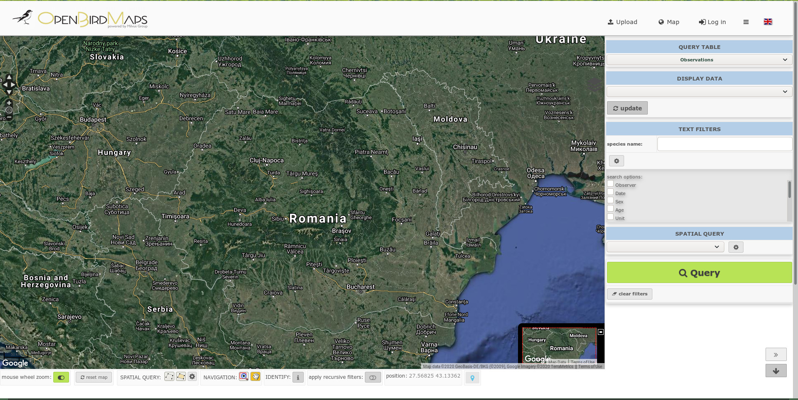
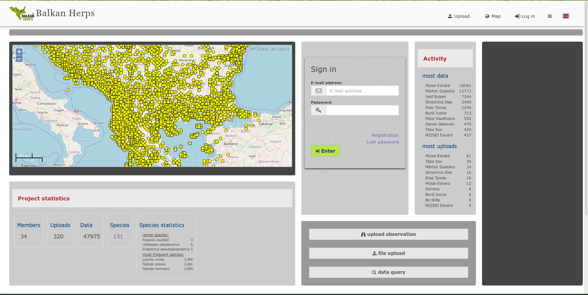
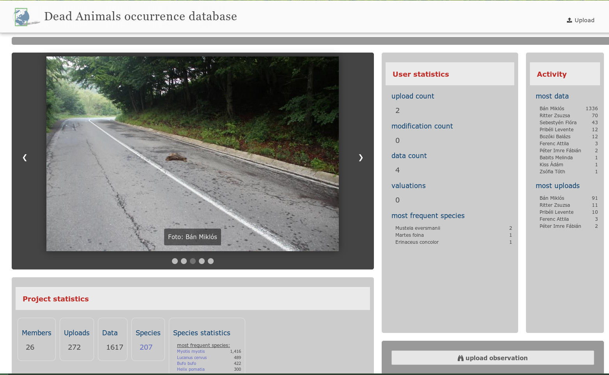
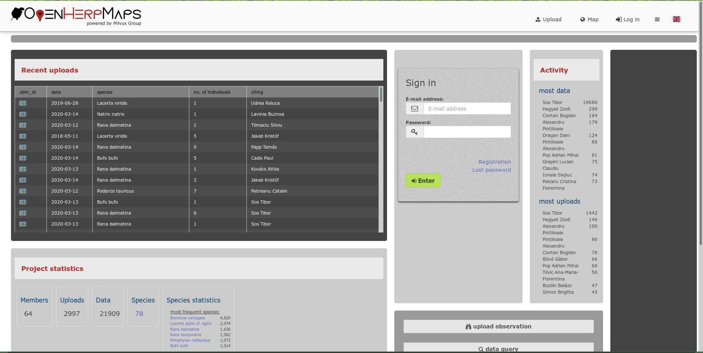
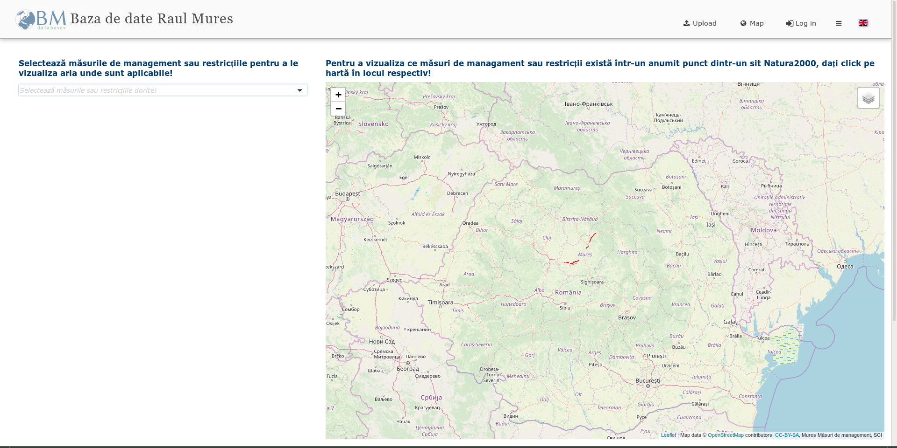
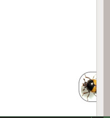
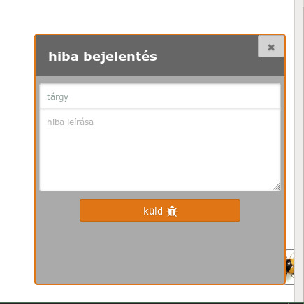

.. _user-interfaces:

Felhasználói felületek
**********************

**Contents:**

.. toctree::
   :maxdepth: 1

   profile.rst
   admin_pages.rst
   new_project.rst
   data_query_interface.rst

Bejelentkezési oldal
====================

Elfelejtett jelszó
------------------
A regisztrált email címünk megadásával itt lehet egy ideiglenes belépési hivatkozást kérni, amit emailben kapunk meg a rendszertől.

Regisztráció
------------

Profil lap
==========
:doc:`Saját profilunkhoz kapcsolódó beállítások <../profile>`.

Meghívások
----------
Aléprtelemezetten minden tag meg tud hívni további tagokat.

:doc:`További információkért látogasd meg a meghívások oldalt <../invitations>.

Üzenetek
--------
Belső üzenetek olvasása és küldése itt történik. Üzenetküldő rendszerünkben négy üzenettípust külöböztetünk meg:

* Rendszerüzenetet a projekt vagy a szerver valamely folyamata küldhet az egyéni felhasználónak. Ilyen üzenet lehet például egy validálási háttérfolyamat üzenete.
* Személyes üzenetet a felhasználók küldhetnek egymásnak. Az üzenet szerkesztő felületet az Üzenetek oldal bal alsó részén található Üzenet írása gombbal érhetjük el.
* Megjegyzések értesítése - Ezt az üzenettípust akkor kapjuk, ha valamely adatunkat, feltöltésünket vagy a felhasználókat valaki kommentelte.
* Hírek - adatfeltöltéskor, új projekt létrehozásakor, poligonok megosztásakor a rendszer létrehoz egy mindenki számára látható hírt.

Az üzenetek oldal minden bejelentkezett felhasználó számára elérhető. Bárki küldhet üzenetet a projekt tagoknak.

A projekt adminisztrátorok az egyéni üzeneken kívül csoportoknak is küldhetnek, valamit emailben értesíthetik a felhasználókat az üzenetekről.

Új adatbázis alapítása
----------------------
Bármelyik regisztrált tag alapíthat egy új adatbázis projektet, amelynek ő lesz a tulajdonosa és teljesen független lesz attól a projekttől amelyben alapították.

:doc:`További információk az adatbázis alapításról<../new_project>`

Projekt adminisztráció
======================
:doc:`Projekt szintű beállítások <../admin_pages>` helye. Például feltöltű űrlapok készítése és térkép beállítások, vagy felhasználó adminisztráció.

Térképi lap
===========

Amennyiben van térképi adat és hozzá tartozó érvényes beállítások (SQL, Mapserver), akkor ezen a alpon lehet a térképi adatokat megtekinteni és lekérdezni. Egyes térképek beállításai jelentősen különbözhetnek, például, lehet, hogy csak a lekérdezett adatok jelennek meg. Lehetnek különféle alaptérképek, pl. rácsok, vagy légifotók, mintavételi helyek egy térképen. Meg lehet jeleníteni pont, vonal és poligon adatokat (külön rétegekben). Számos alaptérkép választható (alapértelmezett az OSM). Egyes projektekben beállítható a google alaptérkép, ha a projekt gazdái ezt valamilyen google számla adatok megadásával megteszik.

térképi lekérdezések
--------------------
Térbeli lekérdezésket lehet indítani a térképre rajzolással, a térképre bökéssel (info modul), vagy előre feltöltött geometriák kiváalsztásával is. Térképi rajzolásnál puffer zóna adatható meg a rajz mutató körül. Azaz egy pont lerakással lekérdezhetünk mondjuk 500m-es sugarú körben, vagy egy vonal körül 10m-es zónában.

szöveges lekérdezések
---------------------
Tetszőleges szöveges lekérdezési lehetőségek állíthatóak be minden projektben az adatok lekérdezésére, amely opciók számos segítő funkciót tartalmazhatnak, pl. auto-szöveg kiegészítést, listás választást, dátum, idő, dátum intervallum választást, többszörös listaelem választást, stb..

lekérdezés eltárolása
---------------------
Egy lekérdezés eredménye eltárolható a szerveren, amely egy tartós azonsítóval hivatkozható. Ezekhez az azonosítókhoz DOI azonosítót lehet kérni. A lekérdezés is eltárolható, amivel meg lehet ismételni a lekérdezést.

Adat feltöltés
==============
Egy adattáblához tetszőleges számú űrlap definiálható, amely űrlapokkal a különféle adatok különböző beállításokkal tölthetőek be. Egyes űrlapok például csak a mobil alakalmazás számára készülhetnek, vagy publikus adatfeltöltésre míg mások kifejezetten egy bizonyos importálandó fájltípushoz.
A feltöltés folyamatában bármikor lehet mentést készíteni és le is lehet tölteni a feltöltési állapotot CSV formátumban.

Fájl feltöltés
--------------
      Támogatott formátumok: 
        
        - Egyszerű szöveges állományok: csv, dsv, tsv, json
        
        - Kép fájlok: jpg, tiff (Exif oszlopok kerülnek kiolvasásra)
        
        - Táblázatkezelő formátumok: ods (Libreoffice), xls (Excel), xlsx (Excel)
        
        - Térbeli formátumok: Esri shape (.shp, .dbf, .cpg, .prj, .shx együttesen), gpx (GPS adatformátum (xml)), sqlite
        
        - Genetikai adatfájlok: fasta
        
      Bármilyen itt felsorolt fájl importálható URL cím megadasával is (egyszerű GET lekérdezés)

Webes űrlap kitöltés
--------------------
Adatokat lehet egy webes űrlap segítségével is feltölteni. Tetszőleges számú sort adhatunk hozzá a táblázatunkhoz feltöltéskor. Az adatok feltöltését gyorsíthatjuk különféle tömeges cellakitöltő funkciók használatával.

Adatfeltöltés történeti lap
---------------------------
Minden egyes adatfeltöltés metaadata automatikusan rögzítésre kerül, amely elérhető a felhasználók profil lapjáról, vagy adatok adatlapjáról is.

Adat lap
========
Minden egyes adatrekordnak van egy saját adatlapja, amely tartalmaz minden kapcsolódó metaadatot és a rekord adatmezőit. Beállításoktól függően különféleképpen korlátozható az elérhető adattartalom.

Adat történeti lap
------------------
Minden egyes adatrekordnak van egy saját adattörténeti adatlapja, ahol megtekinthetőek a rekord változásai. Ez a funkció csak akkor működik, ha projekt beállításokban a projekt gazda engedélyezte az adatváltzás rögzítéseket.

Adatbázis összefoglaló oldal
============================
Minden adatbázishoz tartozik egy összefoglaló oldal ami tartalmazza az adatbázis leírását és kapcsolati adatokat.

Nyitó oldal
===========
Egyéni nyitó oldal készíthető a projektekhez. Ehhez vannak sablonok és előre elkészített funkciók, de tulajdonképpen ez a nyitó oldal bármilyen lehet. Példák:

   
   Nincs külön nyitóoldal beállítva

   
   Térképpel a fő helyen

   
   Képgalériával a fő helyen

   
   Teljes képernyős beuszós képgalériával

   
   Több dobozos nyitóoldal feltöltési történettel a fő helyen

   
   Nyitóoldali felületbe ágyazott projekt

Hiba beküldés
=============
A hibabeküldés funkció a profil oldalról és a feltöltési oldalról érhető el. A képernyő jobb alsó sarkából benéző poszogó taplóbogárra kattintva jelenik meg a hiba beküldő felület.

   
   Bogár a jobb alsó sarokban

   
   Egyszerű üzenetküdő felület
   
A hibákat a felület az OpenBioMaps fejlesztői oldalára küldi (https://gitlab.com/groups/openbiomaps/-/issues), ahonnan a további események kapcsán a felhasználó automatikusan választ kap a rendszertől.

A hibakezelőt egy szerveren a system_vars.php.inc konfigurációs állományban megadott AUTO_BUGREPORT_ADDRESS cím megadásával lehet elérhetővé tenni. További információk a GitLab Issue kezelő felületéről itt olvashatók: https://docs.gitlab.com/ee/user/project/issues/
