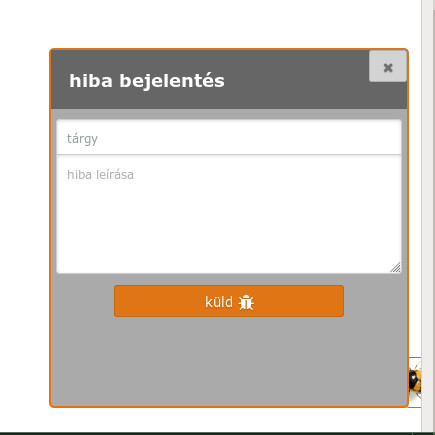

:author: Miklós Bán
:date: 2026-08-08

.. _user-interfaces:

Felhasználói felületek
**********************

Az OpenBioMaps-projektek webalkalmazáson, valamint számos külső
alkalmazáson és programozható felületen keresztül érhetők el. A
webalkalmazás a projektadatok megtekintésének, gyűjtésének,
lekérdezésének és kezelésének elsődleges felülete. A projekt
konfigurációjától és az aktuális felhasználó jogosultságaitól függően az
alábbiakban ismertetett felületek némelyike nem feltétlenül érhető el.

Ez az oldal a legfontosabb felhasználói felületekről ad áttekintést. Az
egyes funkciók konfigurálására vonatkozó részletes útmutatók a
dokumentáció megfelelő adminisztrációs és integrációs fejezeteiben
találhatók.

Webalkalmazás
=============

Az OpenBioMaps webalkalmazás hozzáférést biztosít a projekt adataihoz és
projektspecifikus eszközeihez. Az elérhető oldalak és funkciók a projekt
konfigurációjától, a telepített moduloktól és az aktuális felhasználó
jogosultságaitól függnek.

Bejelentkezési oldal
====================

A bejelentkezési oldalon a regisztrált felhasználók bejelentkezhetnek egy
OpenBioMaps-szerverre. A szerver konfigurációjától függően az oldal
jelszó-helyreállítási, regisztrációs és külső szolgáltatáson keresztüli
hitelesítési lehetőségeket is biztosíthat.

Elfelejtett jelszó
------------------

A regisztrált e-mail-címmel rendelkező felhasználók ideiglenes
bejelentkezési hivatkozást kérhetnek. A rendszer a felhasználói fiókhoz
tartozó e-mail-címre küldi el a hivatkozást.

Regisztráció és csatlakozás egy projekthez
------------------------------------------

Az alapértelmezett munkafolyamatban a felhasználónak egy meglévő
felhasználótól kapott meghívóra van szüksége ahhoz, hogy csatlakozhasson
egy OpenBioMaps-projekthez. Ha a szerveren engedélyezett a nyilvános
regisztráció vagy a külső szolgáltatáson keresztüli hitelesítés, eltérő
regisztrációs munkafolyamat is elérhető lehet.

Ha engedélyezve van a meghívás kérelmezése, a felhasználók a bejelentkezési
oldal regisztrációs hivatkozását követve kérhetnek hozzáférést. Ezeket a
kérelmeket a projektadminisztrátorok kapják meg. A projekt beállításaitól
függően a rendszer automatikusan elküldheti a meghívót, vagy megvárhatja,
hogy egy projektadminisztrátor jóváhagyja a kérelmet, és manuálisan küldje
el a meghívót.

A meghívó e-mail a projekthez való csatlakozásra szolgáló hivatkozást
tartalmaz. A folyamat során a felhasználónak:

* meg kell erősítenie, hogy csatlakozni kíván a projekthez;
* el kell fogadnia a felhasználói megállapodást és az adatkezelési
  nyilatkozatot; valamint
* be kell állítania egy jelszót.

A rendszer további profiladatok megadását is kérheti a felhasználótól.

Profiloldal
===========

A profiloldal hozzáférést biztosít a személyes beállításokhoz és a
felhasználóhoz kapcsolódó tartalmakhoz, többek között a meghívókhoz, az
üzenetekhez, a mentett feltöltési állapotokhoz és a feltöltési
előzményekhez.

A profilbeállításokról további információt az alábbi oldalon talál:
:doc:`Felhasználói profil <profile>`.

Meghívók
--------

Alapértelmezés szerint a regisztrált felhasználók másokat is meghívhatnak,
hogy csatlakozzanak egy projekthez. A meghívót a rendszer a küldő által
kiválasztott nyelven küldi el, az automatikusan létrehozott meghívóhoz pedig
személyes üzenet is hozzáadható.

A meghívó az elküldése után két héttel lejár. Ha a címzett a meghívó
lejárta előtt nem csatlakozik a projekthez, új meghívót kell küldeni.

Alapértelmezés szerint egy felhasználónak projektenként legfeljebb 11 aktív
meghívója lehet. A projektadminisztrátor ezt a korlátot a
``local_vars.php.inc`` fájlban módosíthatja. Ha a korlát értéke ``0``,
csak a projektgazdák küldhetnek meghívót.

.. TODO: Ellenőrizni kell, hogy a meghívók korlátja felhasználónként,
   projektenként vagy a teljes szerveren együttesen érvényes-e. Azt is
   ellenőrizni kell, hogy a „projektgazda” ennek a szerepkörnek a
   felhasználói felületen jelenleg használt neve-e.

Üzenetek
--------

Az OpenBioMaps-projektek belső üzenetküldő rendszert tartalmaznak az
automatikus értesítésekhez és a felhasználók közötti üzenetváltáshoz. A
felhasználók a profiloldalukon beállíthatják, hogy a rendszer az
üzeneteket az e-mail-címükre is továbbítsa-e.

Az üzenetküldő felület a profiloldalról nyitható meg. A felületen a
felhasználók kereshetnek az üzeneteik között, és új üzeneteket hozhatnak
létre. Az üzenetek a következő kategóriákba vannak rendezve:

* Személyes üzenetek;
* Elküldött üzenetek;
* Rendszerüzenetek;
* Értékelések és megjegyzések; valamint
* Hírfolyam.

A projektadminisztrátorok felhasználói csoportoknak címzett üzeneteket,
valamint e-mailben továbbított üzeneteket is küldhetnek. Más felhasználók
egyéni üzeneteket küldhetnek egymásnak.

A kliensalkalmazások is hozzáférhetnek a felhasználó üzeneteihez. Egy
mobilalkalmazás például értesítheti a felhasználót a
projektadminisztrátoroktól vagy más felhasználóktól érkező üzenetekről,
valamint az általa feltöltött rekordokhoz kapcsolódó értékelésekről és
megjegyzésekről.

Új projekt létrehozása
----------------------

A regisztrált felhasználók számára engedélyezhető új adatbázisprojekt
létrehozása. A létrehozó lesz az új projekt tulajdonosa; az új projekt
független attól a projekttől, amelyből létrehozták.

Az útmutatót lásd az alábbi oldalon:
:doc:`Új OpenBioMaps-projekt létrehozása <new_project>`.

Projektadminisztráció
=====================

Alapértelmezés szerint a projektadminisztrációs oldalak a projekt
tulajdonosa vagy alapítója számára érhetők el. Más adminisztrátor
felhasználók is hozzáférést kaphatnak az adminisztrációs funkciókhoz.

Az egyes adminisztrációs funkciókhoz külön-külön is adható hozzáférés. Egy
felhasználó például jogosultságot kaphat a feltöltési űrlapok vagy a
térképbeállítások kezelésére.

Az adminisztrációs felület áttekintését lásd az alábbi oldalon:
:doc:`Projektadminisztráció <admin_pages>`.

Térképoldal
===========

A térképoldal megjeleníti a projekt térbeli adatait, és eszközöket biztosít
a térbeli, valamint az attribútumalapú lekérdezésekhez. Akkor érhető el, ha
a projekt térbeli adatokat tartalmaz – vagyis a projekthez tartozó legalább
egy PostgreSQL-táblában van geometriamező –, továbbá megtörtént a szükséges
adatbázis- és MapServer-beállítások konfigurálása: meghatározták a
lekérdezési sablont, beállították a MapServer mapfile rétegét, és létrehozták
a kapcsolatot a PostgreSQL-szerver és a MapServer között.

A projekt konfigurációjától függően a térkép megjelenítheti az összes
hozzáférhető rekordot vagy csak az aktuális lekérdezés eredményeit. A pont-,
vonal- és poligonadatok külön átfedő rétegeken jeleníthetők meg.

Egy projekt több alaptérképet is biztosíthat. Az alapértelmezett alaptérkép
az OpenStreetMap, de rácshálók, légi felvételek, mintavételi helyszínek vagy
más projektspecifikus rétegek is elérhetők lehetnek. A
projektadminisztrátorok opcionálisan Google-alaptérképet is
konfigurálhatnak, ha rendelkezésre állnak a szükséges Google-fiók- és
API-beállítások.

Térbeli lekérdezések
--------------------

A felhasználók a következő módokon indíthatnak térbeli lekérdezést:

* geometria rajzolásával a térképen;
* helyszín kiválasztásával a térképi információs eszköz használatával; vagy
* egy korábban betöltött geometria kiválasztásával.

A kijelölt vagy megrajzolt geometriára puffer alkalmazható. Egy pont alapú
lekérdezés például tartalmazhatja az 500 méteres sugarú körön belüli
rekordokat, míg egy vonal alapú lekérdezés a vonal körüli 10 méteres
folyosón belüli rekordokat.

Az elérhető rajzolási eszközök, lekérdezési rétegek és
pufferbeállítások a projekt konfigurációjától függenek.

Szöveges és attribútumalapú lekérdezések
----------------------------------------

A projektek egyéni lekérdezési mezőket biztosíthatnak a rekordok
attribútumértékeik szerinti szűréséhez. A mező konfigurációjától függően az
elérhető beviteli vezérlők a következők lehetnek:

* szövegmezők;
* automatikus kiegészítést használó mezők;
* egy- vagy többelemű választólisták;
* dátum- és időmezők; valamint
* dátumtartomány-választók.

A térbeli és az attribútumalapú feltételek együttesen is használhatók, ha
ezt a projekt lekérdezési felülete támogatja.

Lekérdezések mentése és azonosítása
-----------------------------------

A lekérdezés eredménye eltárolható a szerveren, és állandó azonosító
rendelhető hozzá. A megfelelő feltételeket teljesítő tárolt lekérdezésekhez
DOI is igényelhető. A lekérdezések elmenthetők, hogy később
megismételhetők legyenek.

.. TODO: Ismertetni kell a mentett lekérdezés, a tárolt lekérdezési
   eredmény, az állandó kulcsszó és a DOI közötti különbséget. A
   dokumentációnak azt is meg kell határoznia, hogy egy lekérdezés
   megismétlése az eredeti tárolt eredményt adja-e vissza, vagy újból
   végrehajtja a lekérdezést az adatbázis aktuális tartalmán.

Geometriatesztelő
=================

A geometriatesztelő egy különálló, térképalapú felület, amely többek között
GeoJSON- és WKT-formátumban megadott geometriák ellenőrzésére és
szerkesztésére szolgál. OpenStreetMap-kérésekből származó geometriákkal is
használható.

Ez az alkalmazás minden projektben elérhető, ha a fő URL végéhez hozzáadja
a /geometest/ útvonalat, feltéve, hogy más beállítások nem írják felül a fő
URL-t. Például:

https://openbiomaps.org/projects/checkitout/geomtest/

A webes feltöltési felület szintén ezt az alkalmazást használja a helyszínek
térképen történő kiválasztásához és a felhasználók ellenőrzéséhez.

Adatfeltöltési oldal
====================

Az adatfeltöltési oldal a rekordok előkészítésére, validálására és a projekt
adatbázisába történő beküldésére szolgál.

Egy projekt ugyanahhoz az adatbázistáblához több feltöltési űrlapot is
meghatározhat. Az egyes űrlapok különböző mezőket, validálási szabályokat,
beviteli vezérlőket és feltöltési beállításokat biztosíthatnak. Az egyik
űrlap például nyilvános adatközléshez készülhet, míg egy másik
mobilalkalmazáshoz vagy egy adott importformátumhoz lehet optimalizálva.

Az űrlapok létrehozásával és konfigurálásával kapcsolatos információkat lásd
az alábbi oldalon:
:doc:`Feltöltési űrlapok kezelése <upload_forms>`.

Fájlfeltöltés
-------------

A feltöltési felület a következő fájltípusokat támogatja:

* tagolt és strukturált szövegfájlok: CSV, DSV, TSV és JSON;
* képek: JPEG és TIFF, beleértve a támogatott Exif-metaadatokat;
* táblázatok: ODS, XLS és XLSX;
* térbeli adatok: ESRI Shapefile-összetevők, GPX- és SQLite-fájlok; valamint
* genetikai szekvenciaadatok: FASTA.

Egy ESRI Shapefile-feltöltés a kapcsolódó ``.shp``, ``.dbf``, ``.cpg``,
``.prj`` és ``.shx`` fájlokból állhat.

A támogatott fájlok URL-ről, HTTP GET-kérés használatával is importálhatók.

.. TODO: Dokumentálni kell az elfogadott JSON-struktúrát, a szövegfájlok
   elválasztó- és karakterkódolási szabályait, a támogatott Exif-mezőket,
   valamint a SQLite-fájlok elvárt szerkezetét. Azt is ismertetni kell,
   hogyan választhatók ki vagy csomagolhatók össze a több fájlból álló
   Shapefile-ok a feltöltéshez.

.. TODO: Tisztázni kell, hogy az URL-alapú import támogatja-e a HTTPS
   protokollt, a hitelesítést, az átirányításokat és az URL-paramétereket,
   továbbá hogy a távoli URL-ekre vonatkoznak-e szerveroldali
   korlátozások.

Webes űrlapos adatrögzítés
--------------------------

A webes űrlapokon a felhasználók közvetlenül a projekt webes felületén
hozhatnak létre rekordokat. Az adatrögzítő tábla egy táblázatkezelőhöz
hasonlóan működik: az adatbázismezők oszlopokként, a rekordok pedig
sorokként jelennek meg.

Bár a tábla tetszőleges számú sort tartalmazhat, elsősorban néhány tucat,
legfeljebb néhány száz rekord rögzítésére szolgál. Nagyobb adatkészletekhez
ajánlott táblázatot készíteni, majd a fájlfeltöltési felületet használni.

A kötelező mezők fejléce piros, az opcionális mezőké pedig szürke színnel
jelenik meg. Az egyes mezők fejléce alatti sárga beviteli területtel több
sor is kitölthető ugyanazzal az értékkel.

A felület eszközöket biztosít továbbá tömeges módosítások alkalmazásához,
az oszlopértékek formázásához vagy átalakításához, valamint sorok
feltöltésből való kizárásához.

.. TODO: Ismertetni kell az elérhető tömeges szerkesztési, formázási és
   átalakítási funkciókat. Azt is tisztázni kell, hogy a kizárt sor
   megmarad-e a mentett feltöltési állapotban, és később
   visszaállítható-e.

Az adatok validálása és előkészítése
-----------------------------------

A rekordok beküldése előtt a feltöltött vagy manuálisan rögzített adatok
áttekinthetők és javíthatók a feltöltési táblában. Az elérhető validálási
és szerkesztési eszközök a feltöltési űrlaptól és annak konfigurált
mezőitől függenek.

Az előkészítési folyamat során a feltöltési tábla aktuális tartalma bármikor
exportálható CSV-fájlként.

Feltöltés mentése és folytatása
-------------------------------

Egy nagy feltöltés előkészítése jelentős időt vehet igénybe, és a szerverrel
fennálló kapcsolat megszakadhat a rekordok beküldése előtt. Az előkészített
adatok elvesztésének megelőzése érdekében a feltöltési tábla aktuális
állapota elmenthető, és később visszaállítható.

A rendszer körülbelül kétpercenként automatikus biztonsági másolatot is
készít. A mentett és automatikusan biztonsági másolatként tárolt feltöltési
táblák a profiloldalon érhetők el, ahol az elavult biztonsági másolatok
törölhetők.

.. TODO: Tisztázni kell a manuálisan mentett feltöltési állapot és az
   automatikus biztonsági másolat közötti különbséget. Dokumentálni kell
   továbbá a megőrzési időt, a tárhelykorlátokat, a hozzáférési szabályokat
   és azokat a feltételeket, amelyek mellett az automatikus biztonsági
   másolatok törlődnek.

Feltöltési előzmények
---------------------

A rendszer automatikusan rögzíti minden befejezett adatfeltöltés
metaadatait. A felhasználók a profiloldalukon és egy feltöltött rekord
adatlapjáról érhetik el a feltöltési előzményeket.

.. TODO: Fel kell sorolni a feltöltésekről tárolt metaadatokat, ismertetni
   kell, hogy ki tekintheti meg ezeket, továbbá le kell írni, hogyan
   kapcsolódik egy feltöltési előzménybejegyzés az egyes rekordokhoz.

Külső adatbeküldési felületek
-----------------------------

Az adatok külső alkalmazásokból is beküldhetők. A projekt konfigurációjától
és a felhasználó jogosultságaitól függően ezek a következők lehetnek:

* API-kliensek;
* mobil adatgyűjtő alkalmazások;
* az OpenBioMaps R-csomag; valamint
* engedélyezett SQL-kapcsolatot használó alkalmazások.

További információért lásd:

* :doc:`OpenBioMaps API <api>`;
* :doc:`Kliensalkalmazások <clients>`; valamint
* :doc:`Mobilalkalmazások <mobile_applications>`.

Adatlap
=======

Minden adatbázisrekordhoz tartozik egy adatlap, amely a rekord adatmezőit
és a kapcsolódó metaadatokat tartalmazza. A felhasználó számára látható
mezőket és metaadatokat a projekt beállításai és a hozzáférési szabályok
korlátozhatják.

.. TODO: Ismertetni kell, hogyan nyithatják meg a felhasználók az adatlapot,
   milyen metaadat-kategóriákat tartalmaz, továbbá mely projektbeállítások
   vagy hozzáférési szabályok határozzák meg a látható tartalmat.

Adatelőzmények
--------------

Egy rekord adatelőzményei az adott rekordon végzett módosításokat mutatják.
Ez az oldal csak akkor érhető el, ha a projektgazda engedélyezte a
változások naplózását a projekt beállításaiban.

.. TODO: Dokumentálni kell, mely műveleteket rögzíti a rendszer,
   megjelennek-e a mezők korábbi értékei és a szerkesztő személyazonossága,
   ki férhet hozzá az előzményekhez, továbbá hogy visszaállíthatók-e a
   módosítások.

Adatbázis-összefoglaló oldal
============================

Minden projekt tartalmaz egy adatbázis-összefoglaló oldalt, amelyen a
projekt leírása és kapcsolattartási adatai találhatók.

.. TODO: Ismertetni kell, hol érhető el az adatbázis-összefoglaló oldal,
   és meg kell határozni, mely adminisztrációs beállításokból származik a
   tartalma. Azt is tisztázni kell, hogy az oldal tartalmaz-e további
   metaadatokat, hozzáférési feltételeket vagy hivatkozási információkat.

Üdvözlőoldal
============

Minden projekt biztosíthat konfigurálható üdvözlőoldalt. Ez használható a
projekt bemutatására, valamint arra, hogy a felhasználókat a legfontosabb
eszközökhöz és információkhoz irányítsa.

További információért lásd:
:doc:`Az üdvözlőoldal konfigurálása <welcome_page>`.

Egyéb felhasználói felületek
============================

A webalkalmazáson kívül az OpenBioMaps adatai és szolgáltatásai
mobilalkalmazásokból, asztali GIS-szoftverekből, statisztikai szoftverekből
és egyéni API-kliensekből is elérhetők. Az egyes projektekhez rendelkezésre
álló felületek a projekt konfigurációjától és hozzáférési szabályaitól
függenek.

Mobilalkalmazások
-----------------

A mobilalkalmazások támogatják a terepi adatgyűjtést és az
OpenBioMaps-projektekkel folytatott kommunikációt. Az elérhető funkciók az
alkalmazástól, valamint a projekt feltöltési űrlapjaitól és
jogosultságaitól függenek.

További információért lásd:
:doc:`Mobilalkalmazások <mobile_applications>`.

QGIS
----

Az OpenBioMaps QGIS-bővítmény hozzáférést biztosít az OpenBioMaps adataihoz
a QGIS rendszerből. A projektek engedélyezett SQL-kapcsolatokat is
biztosíthatnak a közvetlen adatbázis-hozzáférést igénylő munkafolyamatokhoz.

A támogatott kliensintegrációkról további információt az alábbi oldalon
talál:
:doc:`Kliensalkalmazások <clients>`.

R
-

Az ``obm`` R-csomag eszközöket biztosít az OpenBioMaps adatainak R-ből
történő lekérdezéséhez és feldolgozásához.

`obm a CRAN-on <https://cran.r-project.org/web/packages/obm/index.html>`_

API-kliensek
------------

Az OpenBioMaps API lehetővé teszi az engedélyezett alkalmazások és
parancsfájlok számára a projektadatok lekérdezését vagy beküldését. Az
elérhető műveletek az API-végponttól, a projekt konfigurációjától és a
hitelesített felhasználó jogosultságaitól függenek.

További információért lásd:
:doc:`OpenBioMaps API <api>`.

Hibajelentés
============

Ha a szerveren konfigurálták a hibajelentést, a hibajelentő felület a
profiloldalról és az adatfeltöltési oldalról érhető el. A képernyő jobb alsó
sarkában található hibaikon kiválasztásával egyszerű jelentési űrlap nyílik
meg.

.. figure:: images/hiba_1.jpg
   :scale: 100 %
   :alt: Hibajelentő ikon az oldal jobb alsó sarkában

   Hibajelentő ikon az oldal jobb alsó sarkában

   Hibajelentő űrlap

A hivatalos OpenBioMaps-szolgáltatásokból érkező jelentések továbbíthatók
az `OpenBioMaps hibajegykövető rendszerébe
<https://gitlab.com/groups/openbiomaps/-/issues>`_. A felhasználó
automatikus rendszerüzeneteket kaphat, amikor a jelentéssel kapcsolatban
későbbi események történnek.

A szerveradminisztrátor a ``system_vars.php.inc`` fájlban található
``AUTO_BUGREPORT_ADDRESS`` változó konfigurálásával engedélyezheti a
hibajelentő szolgáltatást. Az OpenBioMaps Consortium által fenntartott
szerverek a konzorcium által biztosított értéket használhatják. Más szerverek
adminisztrátorainak saját kompatibilis hibajegykövető rendszert kell
biztosítaniuk és konfigurálniuk.

.. TODO: Ellenőrizni kell az ``AUTO_BUGREPORT_ADDRESS`` pontos működését és
   elvárt értékét. Dokumentálni kell, hogy a jelentések minden esetben a
   GitLab rendszerébe kerülnek-e, milyen információkat tartalmaznak
   automatikusan, hogyan történik a hitelesítés, és miként kapnak a
   felhasználók értesítést a jelentéseikhez kapcsolódó fejleményekről.
