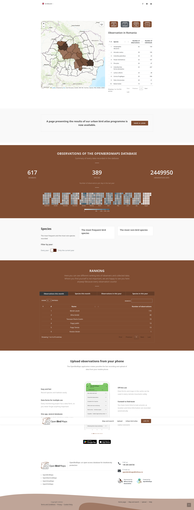
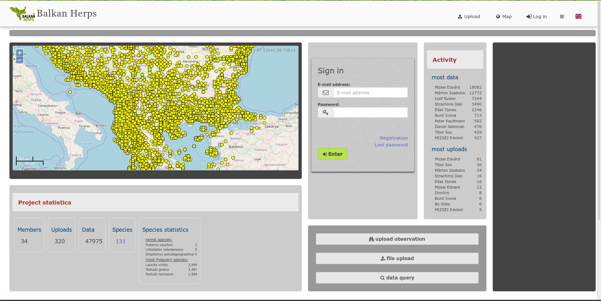
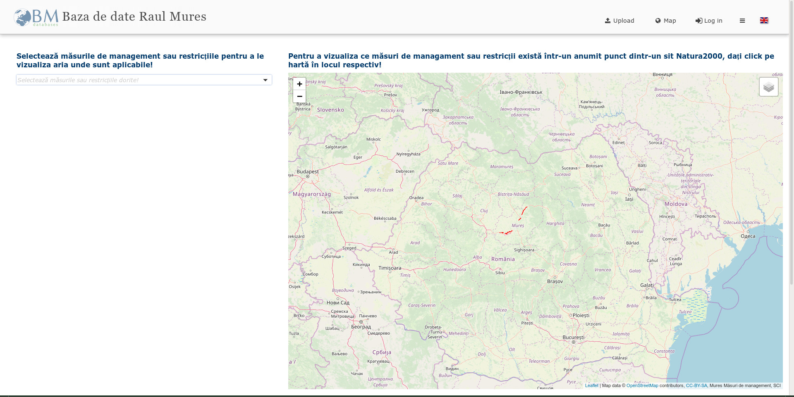

Nyitóoldalak
============

Az OpenBioMaps-projektek testreszabott nyitóoldalt használhatnak. Háromféle
megközelítés érhető el:

* a beépített főoldal;
* egy független egyéni oldalalkalmazás; vagy
* egy modulként telepített egyoldalas alkalmazás.

A megfelelő lehetőség attól függ, hogy a projekt milyen mértékű testreszabást
igényel. A beépített főoldal megfelel az általános elrendezésekhez, míg egy
egyéni oldal vagy egy egyoldalas alkalmazás teljesen testreszabott felületet
biztosíthat.

.. TODO: Pontosan meg kellene adni a főoldalszerkesztő és az egyéni oldal adminisztrációs oldalának menüútvonalát.
   Jó lenne felsorolni a MAINPAGE támogatott sablonjait és konfigurációs kulcsait.
   Az egyéni oldalalkalmazás létrehozásához hasznos lenne egy minimális HTML/JavaScript-példa.
   Pontosítani kellene, melyik routerfájlt és milyen módon kell módosítani SPA használatakor.
   Dokumentálni kellene, hogy az egyéni oldal és az SPA hogyan fér hozzá az OpenBioMaps API-hoz és a bejelentkezett felhasználó munkamenetéhez.
   Érdemes biztonsági útmutatást adni a hozzáférés-vezérlésről, a külső JavaScript-függőségekről és a tartalombiztonsági szabályokról.
   Ellenőrizni kell, hogy a nyitolap_7.jpg, nyitolap_8.jpg és nyitolap_9.jpg képfájlok ténylegesen megtalálhatók-e a dokumentáció images könyvtárában.
   Hasznos lenne minden képnél feltüntetni, hogy a három megoldás közül melyiket és milyen lényeges beállításokat mutatja.

Beépített főoldal
-----------------

A beépített főoldal a projektadminisztrációs felület főoldalszerkesztőjében
állítható be. Az alacsony szintű beállítások a projekt
``local_vars.php.inc`` fájljában is megadhatók.

Ha ezt szeretné nyitóoldalként használni, állítsa a ``LOGINPAGE`` értékét
``mainpage`` értékre. Az OpenBioMaps ezután a ``MAINPAGE`` által meghatározott
főoldalsablont tölti be.

A ``local_vars.php.inc`` példabeállításait, köztük az elérhető ``LOGINPAGE``
és ``MAINPAGE`` értékeket, lásd a :doc:`szervertelepítési útmutatóban
<server_install>`.

Amikor csak lehetséges, a ``local_vars.php.inc`` közvetlen szerkesztése
helyett használja a projektadminisztrációs felületet. A konfiguráció közvetlen
módosítását szerveradminisztrátornak kell elvégeznie, és a módosításokat a
felhasználók számára történő üzembe helyezés előtt tesztelni kell.

Egyéni oldalalkalmazás
----------------------

Egy projekt teljes, független alkalmazást is használhat nyitóoldalként. Az
OpenBioMaps az ilyen típusú alkalmazást egyéni oldalnak nevezi. Az egyéni
oldalak a hozzájuk tartozó projektadminisztrációs oldalakon állíthatók be.

Az egyéni oldal általában HTML, CSS és JavaScript használatával készül.
Használhat JavaScript-keretrendszert, például Vue.js vagy Alpine.js
keretrendszert, de keretrendszer használata nem kötelező. A megvalósításnak
kompatibilisnek kell maradnia a projekt hitelesítési, jogosultságkezelési és
üzembe helyezési környezetével.

Az egyéni oldal közzététele előtt ellenőrizze, hogy a projekt hozzáférési
szabályainak megfelelően működik-e mind a hitelesített, mind a nem
hitelesített látogatók számára. Az oldalt a projekt célközönsége által
használt képernyőméreteken és böngészőkben is tesztelni kell.

Egyoldalas alkalmazás
---------------------

A harmadik lehetőség az egyoldalas alkalmazás modulon keresztül telepített
egyoldalas alkalmazás (SPA). Ha egy SPA-t szeretne a projekt nyitóoldalaként
használni, a projekt útválasztóját úgy kell beállítani, hogy a nyitóoldal
útvonalát az alkalmazáshoz irányítsa.

Az útválasztó módosításai hatással vannak a projekt URL-jeinek kezelésére,
ezért ezeket fejlesztőnek vagy szerveradminisztrátornak kell elvégeznie. Az
útválasztási konfiguráció módosítása után tesztelje a közvetlen navigációt,
az oldalfrissítést, a hitelesítési átirányításokat, valamint a böngésző
vissza és előre történő navigációját.

Az egyoldalas alkalmazásokkal és más OpenBioMaps-modulokkal kapcsolatos
további információkért lásd a :doc:`moduldokumentációt <modules>`.

A megfelelő megközelítés kiválasztása
-------------------------------------

A nyitóoldal megvalósításának kiválasztásakor vegye figyelembe a következőket:

* Akkor használja a beépített főoldalt, ha annak sablonjai és konfigurálható
  összetevői megfelelnek a projekt követelményeinek.
* Akkor használjon egyéni oldalt, ha a projektnek speciális oldalra van
  szüksége, de nincs szüksége teljes körű kliensoldali alkalmazásra.
* Akkor használjon SPA-t, ha a nyitóoldal összetett kliensoldali navigációt,
  állapotkezelést vagy alkalmazásspecifikus interakciókat igényel.
* Részesítse előnyben a követelményeknek megfelelő legegyszerűbb megoldást,
  mivel az egyéni alkalmazások folyamatos fejlesztést, biztonsági
  frissítéseket és böngészőkompatibilitási tesztelést igényelnek.

A nyitóoldal beállítása után ellenőrizze, hogy:

* betöltődik-e a projekt elvárt URL-jén;
* megfelelően működnek-e a be- és kijelentkezési átirányítások;
* az OpenBioMaps-oldalakra mutató hivatkozások a megfelelő projektútvonalat
  használják-e;
* érvényesülnek-e a hozzáférési korlátozások;
* az oldal működik-e mobil- és asztali eszközökön;
* megfelelően betöltődnek-e a képek és más statikus erőforrások; valamint
* ahol ez észszerűen megvalósítható, a hasznos tartalom akkor is elérhető
  marad-e, ha a JavaScript vagy egy külső szolgáltatás nem működik.

Példák
------

A következő képernyőképek különböző projektek nyitóoldalait mutatják be.

   Nyitóoldalként használt egyoldalas alkalmazás.

   Beépített nyitóoldal alapvető beállításokkal és térképpel.

.. figure:: images/nyitolap_3.jpg
   :scale: 50 %
   :alt: Képgalériát tartalmazó beépített nyitóoldal

   Képgalériát tartalmazó beépített nyitóoldal.

   Teljes képernyős nyitóoldal becsúszó képgalériával.

.. figure:: images/nyitolap_5.jpg
   :scale: 50 %
   :alt: Egyéni összesítő táblázatot tartalmazó beépített nyitóoldal

   Beépített nyitóoldal alapvető beállításokkal és egyéni összesítő
   táblázattal.

   Nyitóoldali felületbe ágyazott projekttérkép.

.. figure:: images/nyitolap_7.jpg
   :scale: 50 %
   :alt: Projekt nyitóoldalaként használt egyoldalas alkalmazás

   Nyitóoldalként használt egyoldalas alkalmazás.

.. figure:: images/nyitolap_8.jpg
   :scale: 50 %
   :alt: Projekt nyitóoldalaként használt egyoldalas alkalmazás

   Nyitóoldalként használt egyoldalas alkalmazás.

.. figure:: images/nyitolap_9.jpg
   :scale: 50 %
   :alt: Egyéni projektkezelő alkalmazást tartalmazó beépített nyitóoldal

   Integrált egyéni projektkezelő alkalmazást tartalmazó beépített
   nyitóoldal.
