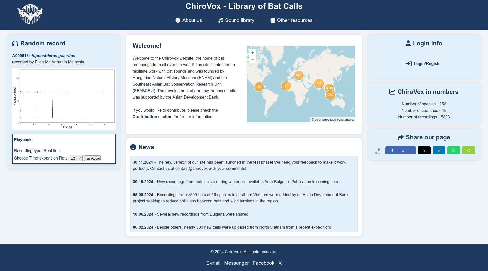

Pagini de destinație
====================

Proiectele OpenBioMaps pot utiliza o pagină de destinație personalizată.
Sunt disponibile trei abordări:

* pagina principală încorporată;
* o aplicație independentă pentru pagina personalizată; sau
* o aplicație cu o singură pagină instalată ca modul.

Opțiunea potrivită depinde de nivelul de personalizare necesar proiectului.
Pagina principală încorporată este adecvată pentru structurile obișnuite, în
timp ce o pagină personalizată sau o aplicație cu o singură pagină poate
oferi o interfață complet personalizată.

.. TODO: Ar fi util să se specifice exact calea meniului către editorul
   paginii principale și către pagina de administrare a paginii
   personalizate.
   Ar fi util să se enumere șabloanele și cheile de configurare acceptate de
   MAINPAGE.
   Pentru crearea unei aplicații pentru pagina personalizată, ar fi util un
   exemplu minimal HTML/JavaScript.
   Trebuie precizat ce fișier al routerului trebuie modificat și în ce mod
   atunci când se utilizează o aplicație cu o singură pagină.
   Trebuie documentat modul în care pagina personalizată și aplicația cu o
   singură pagină pot accesa API-ul OpenBioMaps și sesiunea utilizatorului
   autentificat.
   Ar fi util să se ofere recomandări de securitate privind controlul
   accesului, dependențele JavaScript externe și regulile de securitate a
   conținutului.
   Trebuie verificat dacă fișierele imagine nyitolap_7.jpg, nyitolap_8.jpg și
   nyitolap_9.jpg se găsesc efectiv în directorul images al documentației.
   Ar fi util să se precizeze pentru fiecare imagine care dintre cele trei
   soluții este prezentată și ce setări importante ilustrează.

Pagina principală încorporată
-----------------------------

Pagina principală încorporată poate fi configurată prin editorul paginii
principale din interfața de administrare a proiectului. Setările de nivel
inferior pot fi configurate și în fișierul ``local_vars.php.inc`` al
proiectului.

Pentru a o utiliza ca pagină de destinație, setați ``LOGINPAGE`` la
``mainpage``. OpenBioMaps va încărca apoi șablonul paginii principale
configurat prin ``MAINPAGE``.

Consultați :doc:`ghidul de instalare a serverului <server_install>` pentru
exemple de setări ``local_vars.php.inc``, inclusiv valorile disponibile
pentru ``LOGINPAGE`` și ``MAINPAGE``.

Ori de câte ori este posibil, utilizați interfața de administrare a
proiectului în locul editării directe a fișierului
``local_vars.php.inc``. Modificările directe ale configurației trebuie
efectuate de un administrator de server și testate înainte de a fi
implementate pentru utilizatori.

Aplicație pentru pagina personalizată
-------------------------------------

Un proiect poate utiliza și o aplicație completă și independentă drept
pagină de destinație. OpenBioMaps denumește acest tip de aplicație pagină
personalizată. Paginile personalizate pot fi configurate prin paginile de
administrare ale proiectului.

O pagină personalizată este implementată de obicei cu HTML, CSS și
JavaScript. Aceasta poate utiliza un framework JavaScript precum Vue.js sau
Alpine.js, dar utilizarea unui framework nu este obligatorie. Implementarea
trebuie să rămână compatibilă cu mediul de autentificare, autorizare și
implementare al proiectului.

Înainte de publicarea unei pagini personalizate, verificați dacă aceasta
funcționează atât pentru vizitatorii autentificați, cât și pentru cei
neautentificați, în conformitate cu regulile de acces ale proiectului.
Aceasta trebuie testată și pentru dimensiunile de ecran și browserele
utilizate de publicul-țintă al proiectului.

Aplicație cu o singură pagină
-----------------------------

A treia opțiune este o aplicație cu o singură pagină (SPA), instalată prin
modulul pentru aplicații cu o singură pagină. Pentru a utiliza o SPA drept
pagină de destinație a proiectului, routerul proiectului trebuie configurat
astfel încât să direcționeze ruta paginii de destinație către aplicație.

Modificările routerului afectează modul în care sunt gestionate URL-urile
proiectului și, prin urmare, trebuie efectuate de un dezvoltator sau de un
administrator de server. După modificarea configurației rutelor, testați
navigarea directă, reîmprospătarea paginii, redirecționările de autentificare
și navigarea înainte și înapoi din browser.

Consultați :doc:`documentația modulelor <modules>` pentru mai multe
informații despre aplicațiile cu o singură pagină și despre alte module
OpenBioMaps.

Alegerea unei abordări
----------------------

La alegerea implementării unei pagini de destinație, luați în considerare
următoarele:

* Utilizați pagina principală încorporată atunci când șabloanele și
  componentele sale configurabile îndeplinesc cerințele proiectului.
* Utilizați o pagină personalizată atunci când proiectul necesită o pagină
  specializată, dar nu necesită o aplicație completă pe partea de client.
* Utilizați o SPA atunci când pagina de destinație necesită navigare
  complexă pe partea de client, gestionarea stării sau interacțiuni
  specifice aplicației.
* Preferați cea mai simplă opțiune care îndeplinește cerințele, deoarece
  aplicațiile personalizate necesită dezvoltare continuă, actualizări de
  securitate și testarea compatibilității cu browserele.

După configurarea unei pagini de destinație, verificați dacă:

* se încarcă la URL-ul așteptat al proiectului;
* redirecționările pentru autentificare și deconectare funcționează corect;
* legăturile către paginile OpenBioMaps utilizează calea corectă a
  proiectului;
* restricțiile de acces sunt aplicate;
* pagina funcționează pe dispozitive mobile și desktop;
* imaginile și celelalte resurse statice se încarcă în mod corect; și
* conținutul util rămâne disponibil atunci când JavaScript sau un serviciu
  extern nu funcționează, acolo unde este posibil.

Exemple
-------

Următoarele capturi de ecran prezintă pagini de destinație utilizate de
diferite proiecte.

.. figure:: images/nyitolap_1.jpg
   :scale: 50 %
   :alt: O aplicație cu o singură pagină utilizată ca pagină de destinație a unui proiect

   Aplicație cu o singură pagină utilizată ca pagină de destinație.

.. figure:: images/nyitolap_2.jpg
   :scale: 50 %
   :alt: Pagină de destinație încorporată cu o hartă

   Pagină de destinație încorporată cu setări de bază și o hartă.

.. figure:: images/nyitolap_3.jpg
   :scale: 50 %
   :alt: Pagină de destinație încorporată cu o galerie de imagini

   Pagină de destinație încorporată cu o galerie de imagini.

.. figure:: images/nyitolap_4.jpg
   :scale: 50 %
   :alt: Pagină de destinație pe ecran complet cu o galerie de imagini glisantă

   Pagină de destinație pe ecran complet cu o galerie de imagini glisantă.

.. figure:: images/nyitolap_5.jpg
   :scale: 50 %
   :alt: Pagină de destinație încorporată cu un tabel de sinteză personalizat

   Pagină de destinație încorporată cu setări de bază și un tabel de sinteză
   personalizat.

.. figure:: images/nyitolap_6.jpg
   :scale: 50 %
   :alt: Harta proiectului încorporată într-o interfață de pagină de destinație

   Harta proiectului încorporată într-o interfață de pagină de destinație.

   Aplicație cu o singură pagină utilizată ca pagină de destinație.

.. figure:: images/nyitolap_8.jpg
   :scale: 50 %
   :alt: O aplicație cu o singură pagină utilizată ca pagină de destinație a unui proiect

   Aplicație cu o singură pagină utilizată ca pagină de destinație.

.. figure:: images/nyitolap_9.jpg
   :scale: 50 %
   :alt: Pagină de destinație încorporată cu o aplicație personalizată de gestionare a proiectului

   Pagină de destinație încorporată cu o aplicație personalizată integrată
   pentru gestionarea proiectului.
