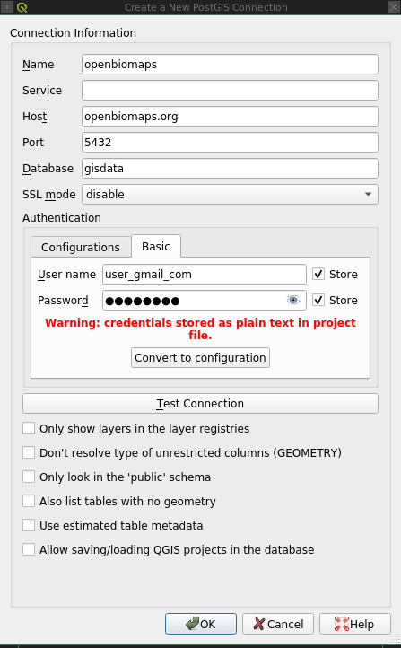

# Модули

Модули — это настраиваемые расширения веб-приложения OpenBioMaps. Они могут
добавлять компоненты пользовательского интерфейса, функции обработки данных,
форматы экспорта, административные инструменты, API или интеграции с внешними
сервисами.

Существуют две основные области действия модулей:

- **Модули уровня проекта** предоставляют функции, относящиеся ко всему
  проекту, например управление пространственными фигурами, поддержку вложений
  или создание пользователей PostgreSQL.
- **Модули уровня таблицы** применяются к определённой таблице данных, например
  фильтры на странице карты, отображение результатов, преобразование данных
  или форматы экспорта.

Модули подключаются к точкам расширения приложения. Большинство доступных
пользователям точек расширения находится на странице карты и странице
профиля, хотя модули также могут добавлять страницы администрирования, API,
фоновые задания и функции, связанные с загрузкой данных.

Большинство модулей принимает параметры в формате JSON. Некоторые модули
вместо этого предоставляют специальный административный интерфейс, а
некоторым требуются как параметры JSON, так и дополнительная конфигурация
базы данных или MapServer.

> **Совместимость версий:** Доступные модули и их параметры могут меняться
> между выпусками OpenBioMaps. Страница администрирования модулей
> установленного приложения является основным источником сведений о модулях,
> доступных проекту. Прежде чем копировать конфигурацию из другой установки,
> проверьте исходный код модуля и примечания к выпуску.

## Администрирование модулей

Модули можно включать и настраивать на странице **Администрирование проекта →
Модули**.

Обычно модуль можно:

- добавить в проект;
- назначить пользователям или группам;
- настроить с помощью параметров JSON;
- включить или отключить; и
- открыть через относящуюся к модулю страницу администрирования, если она
  предусмотрена.

Названия модулей и ключи JSON чувствительны к регистру. Перед сохранением
проверяйте корректность JSON. JSON не допускает комментариев и завершающих
запятых.

### Добавление пользовательского модуля

Пользовательские модули можно загружать и добавлять в проект. Разработчикам
следует использовать примеры модулей из
`resources/includes/modules/examples/` в качестве отправной точки и
сравнивать их реализацию с модулями, включёнными в установленный выпуск
OpenBioMaps.

Код пользовательского модуля должен быть проверен до развёртывания. Модуль
выполняется как часть приложения и может иметь доступ к данным проекта,
сеансу аутентифицированного пользователя и подключениям к базе данных.

### Доступ к модулям

Один и тот же модуль можно добавить несколько раз с различными настройками
доступа или параметрами. Это позволяет администраторам предоставлять разные
конфигурации разным пользователям, группам или таблицам.

Например:

- `allowed_columns` может предоставлять разным группам доступ к различным
  столбцам; и
- `text_filter` может предоставлять относящиеся к таблице столбцы фильтра в
  проекте, содержащем несколько таблиц данных.

Столбец **Access** определяет общую аудиторию экземпляра модуля. Доступные
варианты включают общедоступный доступ и доступ, ограниченный вошедшими в
систему пользователями.

Столбец **Group access** дополнительно ограничивает экземпляр модуля
выбранными группами проекта или отдельными пользователями.

Если к одному пользователю применяются несколько экземпляров одного модуля,
проверьте, какая конфигурация выбирается или объединяется в установленной
версии OpenBioMaps. Избегайте перекрывающихся правил доступа, если их
поведение не определено.

### Включение и отключение модулей

Каждый настроенный экземпляр модуля можно включить или отключить. При
отключении конфигурация модуля сохраняется, но использовать его нельзя.

После изменения состояния модуля проверьте соответствующую страницу от имени
пользователей из каждой затронутой группы доступа. Некоторые модули также
создают объекты базы данных или сохраняют относящиеся к модулю настройки
после отключения.

### Удаление модулей

В настоящее время интерфейс администрирования модулей не предоставляет общего
способа удаления установленного модуля из приложения.

Настроенный экземпляр модуля можно отключить. Не удаляйте файлы модуля или
объекты базы данных вручную, если процедура удаления модуля неизвестна или
отсутствует резервная копия.

### Параметры модулей

Большинство модулей принимает параметры JSON непосредственно на странице
администрирования модулей. Другие модули предоставляют специальную вкладку
администрирования для относящихся к модулю задач. `box_load_selection` —
пример модуля с собственным административным интерфейсом.

В примерах этого документа используются местозаполнители, такие как
`YOURTABLE`, `column_name` и `schema.table`. Замените эти местозаполнители
идентификаторами проекта.

## Модули уровня проекта

### `box_load_selection`

Модуль `box_load_selection` управляет повторно используемыми
пространственными фигурами.

Он предоставляет следующие функции:

- Пользователи могут загружать точки, линии и полигоны. Обычно используется
  ESRI Shapefile, однако могут поддерживаться и другие стандартные
  пространственные форматы.
- Загруженные фигуры можно использовать для определения пространственного
  охвата запроса данных.
- Фигура может предоставлять геометрию записи при загрузке через
  веб-интерфейс или из файла.
- Фигурами можно делиться с другими пользователями.
- Доступные пользователю фигуры можно скачивать и отображать в мобильном
  приложении.

По умолчанию новые загруженные фигуры недоступны другим пользователям.
Администраторы проекта могут предоставлять пользователям разрешение на
использование каждой фигуры для запросов или загрузки данных.

Пользователи могут управлять опубликованными фигурами через блок модуля
**Shared geometries** на странице своего профиля. Администраторы проекта
могут управлять этими разрешениями через вкладку администрирования
`box_load_selection`.

Когда модуль включён, на странице карты появляется блок **Spatial query**.
Пользователи могут выбрать доступную фигуру и выполнить пространственный
запрос к ней. Для полигональной геометрии интерфейс может позволять
пользователям выбирать, следует ли включать записи, пересекающие границу
полигона.

Если форма загрузки использует поле `obm_geometry`, элемент управления картой
может предоставлять вариант **Geometry from list**. При выборе именованной
фигуры её геометрия WKT вставляется в поле загрузки.

Мобильное приложение может отображать доступные фигуры загрузки на картах
форм в полупрозрачном виде с указанием их названий.

**Параметры:** Отсутствуют. Модуль использует специальный административный
интерфейс.

### `photos`

Модуль `photos` включает поля фотографий и других вложений в формах загрузки
и отображает прикреплённые изображения на страницах паспортов записей.

Ограничения размера файлов, разрешённые типы файлов, хранилище, контроль
доступа и требования к резервному копированию также необходимо настроить на
уровне приложения и сервера.

**Параметры:** Отсутствуют.

### `create_pg_user`

Модуль `create_pg_user` позволяет авторизованным пользователям создавать
личные учётные записи PostgreSQL.

Когда модуль включён:

- на странице профиля авторизованных пользователей появляется блок
  **Create PostgreSQL user**;
- пользователи могут создавать и продлевать собственную учётную запись базы
  данных;
- созданная учётная запись назначается группе пользователей PostgreSQL
  проекта; и
- учётную запись можно использовать в клиентах базы данных, таких как QGIS.

По умолчанию созданная учётная запись:

- имеет доступ на чтение к таблицам базы данных проекта;
- ограничена одним одновременным клиентским подключением; и
- действует в течение одного года.

Созданная учётная запись добавляется в группу PostgreSQL, названную в честь
проекта, обычно в формате `PROJECT_user`. Администратор базы данных может
предоставить дополнительные разрешения, например доступ на запись к
выбранным таблицам, однако должен следовать принципу минимальных привилегий.

Пользователи могут продлевать доступ до или после истечения срока его
действия в соответствии с правилами установленного модуля.

На следующем снимке экрана показан пример подключения PostgreSQL/PostGIS в
QGIS:



Не открывайте PostgreSQL для общедоступного интернета без соответствующих
настроек межсетевого экрана, TLS, аутентификации и контроля доступа.

**Параметры:** Отсутствуют. В текущих выпусках может предоставляться
специальная страница администрирования.

### `computation`

Модуль `computation` предоставляет относящиеся к проекту вычислительные
функции.

Его точное поведение зависит от версии установленного модуля и конфигурации
проекта. Перед включением модуля в рабочем проекте изучите его реализацию.

**Параметры:** Не задокументированы.

### `custom_filetype`

Модуль `custom_filetype` поддерживает относящуюся к проекту подготовку
пользовательских форматов скачивания, например CSV-файла в стиле Observado.

Формат вывода и необходимая пользовательская реализация зависят от проекта.

**Параметры:** Не задокументированы.

### `taxon_meta`

Модуль `taxon_meta` предоставляет функции метаданных, относящиеся к таксонам.

Его пользовательский интерфейс, необходимую структуру базы данных и
конфигурацию следует сверять с версией установленного модуля.

**Параметры:** Не задокументированы.

## Модули уровня таблицы

### `additional_columns`

Модуль `additional_columns` определяет столбцы, используемые для связывания
записей между несколькими таблицами данных.

Если таблицы связаны общим идентификатором, запросы могут включать связанные
с этим идентификатором записи. Пользователи могут не выполнять эти соединения,
выбрав **Ignore table joins** на странице карты.

Например, проект может хранить записи о родительских особях и потомстве в
отдельных таблицах и использовать общий идентификатор норы в качестве
столбца соединения.

Используйте этот модуль совместно с `join_tables`.

Модуль возвращает:

- массив столбцов с индексом `0`; и
- ассоциативный массив названий столбцов с индексом `1`.

**Параметры:**

```json
[
  "column_name_1",
  "column_name_2"
]
```

### `allowed_columns`

Модуль `allowed_columns` дополняет правила построчного доступа ограничениями
на уровне столбцов.

Правила построчного доступа определяют, к каким записям может получать доступ
пользователь. Этот модуль определяет, какие столбцы остаются видимыми, когда
к записи применяется правило `restricted` или `no-geom` либо когда
подходящее правило отсутствует.

Модуль предназначен для проектов, базовый уровень доступа которых не
является общедоступным и таблицы данных которых используют соответствующую
таблицу правил.

**Параметры:**

```json
{
  "for_sensitive_data": [
    "column_visible_for_sensitive_records"
  ],
  "for_no-geom_data": [
    "column_visible_for_records_without_geometry_access"
  ],
  "for_general": [
    "column_visible_when_no_rule_matches"
  ]
}
```

Значения параметров:

- `for_sensitive_data` содержит столбцы, видимые для конфиденциальных записей.
- `for_no-geom_data` содержит столбцы, видимые для записей `no-geom`. Если
  этот ключ отсутствует, для таких записей доступны все столбцы.
- `for_general` содержит столбцы, видимые при отсутствии подходящего правила.
  Если этот ключ отсутствует, в таком случае доступ ко всем столбцам
  ограничен.

Проверьте фактические разрешения для общедоступных, аутентифицированных,
входящих в группу пользователей и администраторов. Ограничения столбцов не
должны рассматриваться как замена корректному контролю доступа к базе данных
и API.

### `bold_yellow`

Модуль `bold_yellow` определяет важные поля в сводной информации о
результатах.

Настроенные столбцы выделяются жирным жёлтым шрифтом в подробных списках
результатов. Мобильное приложение также использует эту конфигурацию для
выбора значений, отображаемых в подписях сводной информации **Collected
data**.

**Параметры:**

```json
[
  "column_name_1",
  "column_name_2"
]
```

### `box_load_coord`

Модуль `box_load_coord` добавляет блок **Position** под картой.

Этот блок:

- отображает координаты текущего положения указателя; и
- позволяет пользователю ввести значения широты и долготы и поместить
  соответствующую точку на карту.

Параметры сопоставляют отображаемые пользователю названия систем координат с
кодами EPSG.

**Параметры:**

```json
{
  "wgs84": "4326",
  "eov": "23700"
}
```

Настраивайте только системы координат, поддерживаемые проектом и его
картографическими компонентами.

### `box_load_last_data`

Модуль `box_load_last_data` добавляет блок **Quick queries** на страницу
карты.

Он предоставляет запросы для:

- последней загрузки текущего пользователя;
- последней загрузки любого пользователя; и
- последних загруженных записей.

Первые два варианта возвращают одну запись. Параметр управляет количеством
записей, возвращаемых третьим вариантом. Задокументированное значение по
умолчанию — 10.

**Параметры:**

```json
[
  10
]
```

### `box_custom`

Модуль `box_custom` загружает относящийся к проекту пользовательский блок на
странице карты.

Пользовательская реализация должна находиться в каталоге проекта
`local/includes/modules/`. Её класс должен предоставлять как минимум методы
`print_box()` и `print_js()`.

Для пользовательского модуля, хранящегося в:

`local/includes/modules/hrsz_query.php`

параметр содержит базовое имя файла:

```json
[
  "hrsz_query"
]
```

Ожидается, что соответствующий класс будет называться `hrsz_query_Class`.

Код пользовательского модуля должен проверять входные данные, экранировать
выходные данные, обеспечивать соблюдение разрешений и использовать
параметризованные запросы к базе данных.

### `identify_point`

Модуль `identify_point` позволяет пользователям определять одну или несколько
точек на карте и отображает выбранные значения атрибутов во всплывающем окне
карты.

**Параметры:**

```json
[
  "column_name_1",
  "column_name_2"
]
```

Включайте только те столбцы, доступ к которым разрешён предполагаемой
аудитории модуля.

### `cameratrap_api`

Модуль `cameratrap_api` обеспечивает взаимодействие между панелью управления
фотоловушками и API Nextcloud.

Его функции включают:

- управление камерами и анализами;
- загрузку и скачивание изображений;
- запуск анализов; и
- управление учётными данными Nextcloud, необходимыми для интеграции.

Модуль создаёт или использует относящиеся к нему объекты базы данных. Перед
его включением изучите файл установки SQL и требования к доступу.

**Параметры:** Не задокументированы.

### `nextcloud_connect`

Модуль `nextcloud_connect` подключает OpenBioMaps к серверу Nextcloud. Он
обеспечивает интеграцию с профилем пользователя и выдаёт токены JWT для
аутентификации.

URL-адреса Nextcloud, учётные данные, секреты подписи, сроки действия токенов
и проверку TLS необходимо безопасно настроить с помощью механизмов,
предусмотренных установленным выпуском.

**Параметры:** Не задокументированы.

### `validation`

Модуль `validation` предоставляет внутренний API и административный интерфейс
для алгоритмов проверки данных.

Его функции включают:

- управление правилами проверки;
- проверку записей; и
- журналирование действий по проверке.

Относящиеся к проекту реализации проверки могут выполнять дополнительные
проверки загружаемых данных.

**Параметры:** Не задокументированы. Дополнительные правила управляются через
интерфейс администрирования модуля и компоненты проверки.

### `download_restricted`

Модуль `download_restricted` предоставляет управляемый администратором
процесс авторизации скачивания.

Вместо немедленного получения доступа к скачиванию пользователи отправляют
запрос с описанием предполагаемого использования данных. Администраторы
могут одобрить или отклонить запрос через интерфейс администрирования модуля.

Модуль предоставляет:

- форму запроса на скачивание;
- административный процесс одобрения; и
- интеграцию с `results_buttons`.

При использовании совместно с `results_buttons` варианты экспорта становятся
доступны только пользователям, запрос и разрешения которых допускают
скачивание.

Включение этого модуля не отменяет необходимости серверных проверок доступа.
Проверьте прямые URL-адреса экспорта и API, чтобы убедиться, что ограничения
на скачивание невозможно обойти.

**Параметры:** Отсутствуют. Модуль использует специальный административный
интерфейс.

### `extra_params`

Расширение `extra_params` предоставляет формам дополнительные входные
параметры.

Точный синтаксис и доступность этого расширения необходимо сверять с
установленным выпуском OpenBioMaps, поскольку отдельный модуль с таким
названием может присутствовать не во всех версиях.

**Параметры:** Стабильный формат параметров здесь не задокументирован.

### `grid_view`

Модуль `grid_view` отображает данные с использованием альтернативных
полигональных сеток. Примеры включают сетки UTM, сетки KEF, привязанные к
сетке точки и динамически создаваемые полигоны сетки.

Когда представление сетки активно, для соответствующего отображения вместо
исходной геометрии записи используется геометрия, предоставленная модулем.

Реализация модуля предоставляет методы, включая:

- `print_box()`;
- `default_grid_geom()`; и
- `get_grid_layer()`.

#### Параметры

```json
{
  "layer_options": [
    "kef_5 (layer_data_grid)",
    "original (layer_data_points)"
  ]
}
```

Каждая запись `layer_options` сопоставляет столбец геометрии со слоем
MapServer:

- текст перед круглыми скобками — столбец в `YOURTABLE_qgrids`; и
- текст внутри круглых скобок — соответствующее имя слоя MapServer.

В этом примере:

- `kef_5` — столбец геометрии в `YOURTABLE_qgrids`;
- `layer_data_grid` — полигональный слой MapServer, используемый для его
  отображения;
- `original` хранит исходную геометрию; и
- `layer_data_points` отображает исходные точки.

Для геометрии сетки требуется совместимый слой MapServer. Например,
`layer_data_grid` должен быть полигональным слоем, если он отображает
полигональные сетки.

#### Таблица сетки

Модуль создаёт `YOURTABLE_qgrids`, если эта таблица ещё не существует. Затем
таблицу можно расширить столбцами геометрии, необходимыми проекту.

Модуль также может создать триггер `update_grid_geoms` и исходные комментарии
столбцов. Обычно созданные объекты требуют проверки и изменения с учётом
особенностей проекта.

Задайте отображаемые пользователю названия вариантов сетки в комментариях к
столбцам:

```sql
COMMENT ON COLUMN public.YOURTABLE_qgrids.original IS 'Original';
COMMENT ON COLUMN public.YOURTABLE_qgrids.kef_5 IS 'KEF 5×5';
```

Соблюдайте согласованность идентификаторов SQL. Например, не настраивайте
`kef_5` в модуле, если создан столбец с именем `kef5`.

#### Триггер таблицы сетки

Следующий пример вызывает относящуюся к проекту функцию обновления сетки:

```sql
CREATE TRIGGER update_grid_geoms
BEFORE INSERT OR UPDATE ON public.YOURTABLE_qgrids
FOR EACH ROW
EXECUTE PROCEDURE public.update_qgrid_geoms_arg(
  '0.1',
  '0.1',
  't',
  't',
  't',
  't',
  '0.05'
);
```

> **Важно:** Количество и порядок аргументов триггера должны точно
> соответствовать установленному определению `update_qgrid_geoms_arg()`.
> Приведённый ниже исторический пример функции считывает аргументы вплоть до
> `TG_ARGV[8]`, тогда как приведённый выше пример триггера передаёт только
> семь аргументов. Не развёртывайте эти примеры без изменений. Изучите
> установленный файл `grid_view.sql` и функцию базы данных, затем передайте
> все необходимые аргументы.

#### Триггер исходной таблицы

Для исходной таблицы необходим триггер, копирующий изменения в таблицу сетки:

```sql
CREATE TRIGGER qgrids
BEFORE INSERT OR DELETE OR UPDATE ON public.YOURTABLE
FOR EACH ROW
EXECUTE PROCEDURE insert_originalgeom_into_qgrids();
```

Пример тела функции:

```sql
BEGIN
  IF TG_OP = 'INSERT' THEN
    EXECUTE format(
      'INSERT INTO %I_qgrids (row_id, original) SELECT %L, %L::geometry',
      TG_TABLE_NAME,
      NEW.obm_id,
      NEW.obm_geometry
    );
    RETURN NEW;
  END IF;

  IF TG_OP = 'UPDATE' THEN
    EXECUTE format(
      'UPDATE %I_qgrids SET original = %L::geometry WHERE row_id = %L',
      TG_TABLE_NAME,
      NEW.obm_geometry,
      NEW.obm_id
    );
    RETURN NEW;
  END IF;

  IF TG_OP = 'DELETE' THEN
    EXECUTE format(
      'DELETE FROM %I_qgrids WHERE row_id = %L',
      TG_TABLE_NAME,
      OLD.obm_id
    );
    RETURN OLD;
  END IF;

  RETURN NULL;
END;
```

Это только тело функции триггера, а не полная команда `CREATE FUNCTION`.

#### Функция обновления сетки

Следующий исторический пример демонстрирует предполагаемые операции:

```sql
DECLARE
  snap_x numeric := TG_ARGV[0];
  snap_y numeric := TG_ARGV[1];
  kef5 boolean := TG_ARGV[2];
  utm10 boolean := TG_ARGV[5];
  snap boolean := TG_ARGV[6];
  snap_polygon boolean := TG_ARGV[7];
  snap_polygon_size numeric := TG_ARGV[8];
BEGIN
  IF TG_OP = 'UPDATE' THEN
    IF kef5 THEN
      EXECUTE format(
        'SELECT geometry FROM shared."kef_5x5" WHERE ST_Within(%L::geometry, geometry)',
        NEW.original
      )
      INTO NEW.kef_5;
    END IF;

    IF snap THEN
      EXECUTE format(
        'SELECT ST_SnapToGrid(%L::geometry, %L, %L)',
        NEW.original,
        snap_x,
        snap_y
      )
      INTO NEW.snap;
    END IF;

    IF snap_polygon THEN
      EXECUTE format(
        'SELECT ST_Expand(ST_SnapToGrid(%L::geometry, %L, %L), %L)',
        NEW.original,
        snap_x,
        snap_y,
        snap_polygon_size
      )
      INTO NEW.snap_polygon;
    END IF;

    RETURN NEW;
  END IF;

  IF TG_OP = 'INSERT' THEN
    IF kef5 THEN
      EXECUTE format(
        'SELECT geometry FROM shared."kef_5x5" WHERE ST_Within(%L::geometry, geometry)',
        NEW.original
      )
      INTO NEW.kef_5;
    END IF;

    IF snap THEN
      EXECUTE format(
        'SELECT ST_SnapToGrid(%L::geometry, %L, %L)',
        NEW.original,
        snap_x,
        snap_y
      )
      INTO NEW.snap;
    END IF;

    IF snap_polygon THEN
      EXECUTE format(
        'SELECT ST_Expand(ST_SnapToGrid(%L::geometry, %L, %L), %L)',
        NEW.original,
        snap_x,
        snap_y,
        snap_polygon_size
      )
      INTO NEW.snap_polygon;
    END IF;

    RETURN NEW;
  END IF;

  RETURN NEW;
END;
```

Это также только тело функции. Переменная `utm10` объявлена, но не
используется в показанной реализации. Проверьте и дополните функцию для
необходимых проекту типов сетки.

#### Первоначальное заполнение

После подготовки таблицы сетки и триггеров существующие исходные геометрии
можно скопировать в пустую таблицу сетки:

```sql
INSERT INTO YOURTABLE_qgrids (row_id, original)
SELECT obm_id, obm_geometry
FROM YOURTABLE;
```

Пример обновления для геометрии, привязанной к сетке:

```sql
UPDATE YOURTABLE_qgrids AS q
SET snap = source.snapped_geometry
FROM (
  SELECT
    obm_id,
    ST_SnapToGrid(obm_geometry, 0.13, 0.09) AS snapped_geometry
  FROM YOURTABLE
) AS source
WHERE q.row_id = source.obm_id;
```

Пример обновления с использованием полигонов из общей таблицы сетки:

```sql
UPDATE YOURTABLE_qgrids AS q
SET kef_5 = source.grid_geometry
FROM (
  SELECT
    data.obm_id,
    grid.obm_geometry AS grid_geometry
  FROM YOURTABLE AS data
  LEFT JOIN shared.kef_5x5 AS grid
    ON ST_Within(data.obm_geometry, grid.obm_geometry)
) AS source
WHERE q.row_id = source.obm_id;
```

В этом примере `shared.kef_5x5` содержит предопределённые полигоны сетки.
Другая геометрия, например `snap`, может создаваться динамически.

Сначала выполняйте изменения схемы и массовые обновления в тестовой среде.
Создайте резервную копию базы данных, проверьте пространственные индексы и
поведение для пустых, недействительных, граничных и неточечных геометрий.

### Задания проверки `job_manager`

Диспетчер заданий проверки настраивает фоновые процессы проекта.

На его странице администрирования администраторы могут настроить:

- упрощённое расписание, содержащее значения минут, часов и дней; и
- относящиеся к заданию параметры в формате JSON.

Добавление задания регистрирует его в таблице заданий проекта и может
создавать файлы шаблонов в каталогах модуля проверки и заданий.

Доступность и точное название этого компонента могут зависеть от
установленного модуля проверки. Фоновые задания выполняются только в том
случае, если средство запуска `jobs.php` проекта настроено на сервере.

**Параметры:** Список названий фоновых заданий.

#### `observation_lists`

Задание `observation_lists` обрабатывает списки наблюдений, загруженные
мобильным приложением.

Первоначально загруженные наблюдения поступают во временную таблицу. Задание:

- заполняет `obm_observation_list_id`;
- вычисляет или копирует значения начала, окончания и продолжительности
  списка; и
- копирует полные списки в целевую таблицу.

Неполные списки пропускаются для последующей обработки.

Параметры задания:

- `list_start_column`: столбец, в котором хранится начало списка;
- `list_end_column`: столбец, в котором хранится окончание списка;
- `list_duration_column`: столбец, в котором хранится продолжительность;
- `only_time`: определяет, следует ли хранить только время вместо полной
  временной метки;
- `time_as_int`: определяет, следует ли преобразовывать время или
  продолжительность в минуты.

Пример:

```json
{
  "YOURTABLE": {
    "list_start_column": "time_of_start",
    "list_end_column": "time_of_end",
    "list_duration_column": "duration",
    "only_time": true,
    "time_as_int": true
  }
}
```

#### `incomplete_observation_lists`

Задание `incomplete_observation_lists` обрабатывает списки, которые остаются
неполными.

Если разница между ожидаемым и полученным количеством наблюдений находится в
пределах настроенного допуска, список может быть обработан при следующем
запуске `observation_lists`, а также отправляется системное сообщение.

Если разница превышает допуск, задание отправляет системное сообщение, но
оставляет список для ручной обработки.

Параметры задания:

- `mail_to`: числовой идентификатор роли, участники которой получают
  сообщение;
- `diff_tolerance`: допустимая разница, после превышения которой требуется
  ручная обработка;
- `days_offset`: количество дней ожидания перед обработкой неполного списка.

Пример:

```json
{
  "YOURTABLE": {
    "mail_to": 1265,
    "diff_tolerance": 2,
    "days_offset": 2
  }
}
```

Прежде чем полагаться на этот процесс в рабочей среде, проверьте получателей
уведомлений и расписание заданий.

### `join_tables`

Модуль `join_tables` отображает связанные записи на странице паспорта
данных.

Текущая задокументированная реализация поддерживает простые операции `LEFT
JOIN` с одним условием равенства для каждой присоединяемой таблицы.

**Параметры:**

```json
[
  {
    "table": "events",
    "join_on": [
      {
        "ref_field": "obm_id",
        "join_field": "patient_id"
      }
    ]
  },
  {
    "table": "measurements",
    "join_on": [
      {
        "ref_field": "obm_id",
        "join_field": "record_id"
      }
    ]
  }
]
```

Для каждой присоединяемой таблицы:

- `table` — присоединяемая таблица;
- `ref_field` — поле текущей записи; и
- `join_field` — соответствующее поле присоединяемой таблицы.

При необходимости используйте этот модуль совместно с
`additional_columns`. Убедитесь, что поля соединения индексированы и
пользователям разрешён доступ к данным из каждой присоединяемой таблицы.

### `list_manager`

Модуль `list_manager` управляет повторно используемыми списками терминов для
загрузки данных и запросов.

Он предоставляет:

- создание и редактирование списков;
- связывание списков с таблицами и столбцами базы данных;
- создание содержимого списков на основе существующих данных;
- хранение данных списков в базе данных; и
- обратную связь с пользователем при неудачном выполнении операции со
  списком.

Модуль использует модальное диалоговое окно для редактирования значений
списка. Доступ к его административным функциям следует ограничить
пользователями, которым разрешено изменять словари загрузки и запросов.

**Параметры:** Отсутствуют. Модуль использует собственный пользовательский
интерфейс и относящиеся к нему объекты базы данных.

### `massive_edit`

Модуль `massive_edit` позволяет авторизованным пользователям редактировать
несколько выбранных записей на странице карты через интерфейс загрузки
файлов.

Массовые изменения могут затрагивать множество записей. Проверьте разрешения,
создайте резервную копию и протестируйте изменённый файл на небольшой выборке
перед применением крупного обновления.

**Параметры:** Отсутствуют.

### `move_project`

Модуль `move_project` переносит проект на другой сервер OpenBioMaps.

Это экспериментальный модуль. Перед его использованием создайте и проверьте
резервные копии, а также совместимость версий приложения, расширений базы
данных, файлов проекта, пользователей, модулей, конфигурации MapServer и
секретов на целевом сервере.

**Параметры:** Не задокументированы.

### `read_table`

Модуль `read_table` предоставляет доступ к таблице или представлению SQL в
виде прокручиваемой HTML-таблицы через уникальную ссылку.

**Параметры:**

```json
[
  {
    "table": "schema.table_name",
    "label": "Displayed table name",
    "orderby": "column_name"
  }
]
```

Каждая запись содержит:

- `table`: имя таблицы или представления с указанием схемы;
- `label`: отображаемая пользователю подпись; и
- `orderby`: столбец, используемый для сортировки по умолчанию.

Уникальная или трудно угадываемая ссылка не является достаточным средством
контроля доступа. Убедитесь, что модуль обеспечивает соблюдение
предусмотренных разрешений на уровне проекта, группы и записи.

### `results_asList`

Модуль `results_asList` отображает результаты запроса в виде сворачиваемых
записей, похожих на слайды.

**Параметры:** Отсутствуют.

### `results_asGPX`

Модуль `results_asGPX` экспортирует результаты запроса в файл GPX.

**Параметры:**

```json
{
  "name": "name_column",
  "description": [
    "description_column_1",
    "description_column_2"
  ]
}
```

Столбец `name` предоставляет имя объекта GPX. Значения из столбцов
`description` включаются в описание объекта.

Можно экспортировать только геометрию, совместимую с установленным средством
экспорта GPX.

### `results_asCSV`

Модуль `results_asCSV` экспортирует результаты запроса в файл CSV.

**Параметры:**

```json
{
  "sep": ",",
  "quote": "\""
}
```

- `sep` определяет разделитель полей.
- `quote` определяет символ обрамления полей.

Выберите настройки, совместимые с программным обеспечением, используемым для
открытия экспорта. При экспорте по-прежнему должны соблюдаться все
применимые правила доступа на уровне строк и столбцов.

### `results_asJSON`

Модуль `results_asJSON` экспортирует результаты запроса в формате JSON.

**Параметры:** Отсутствуют.

### `results_asTable`

Модуль `results_asTable` отображает результаты запроса в виде полноэкранной
HTML-таблицы, содержащей все доступные поля.

Он предоставляет:

- отображение полной записи;
- сортируемые столбцы; и
- ссылки для просмотра или редактирования записей, если пользователь имеет
  необходимые разрешения.

Отображение всех доступных полей может требовать значительных ресурсов для
больших наборов результатов и раскрывать поля, доступ к которым должен быть
ограничен. Настройте модули контроля доступа и проверьте вывод для каждой
группы пользователей.

**Параметры:** Отсутствуют.

### `results_asKML`

Модуль `results_asKML` экспортирует результаты запроса в файл KML.

**Параметры:**

```json
{
  "name": "name_column",
  "description": [
    "description_column_1",
    "description_column_2"
  ]
}
```

Столбец `name` предоставляет имя объекта KML. Значения из столбцов
`description` включаются в описание объекта.

### `results_buttons`

Модуль `results_buttons` добавляет на страницу карты элементы управления для
скачивания, сохранения, публикации и создания закладок для результатов
запроса.

Доступные форматы скачивания зависят от соответствующих включённых модулей
экспорта. Они могут включать CSV, GPX, KML, SHP и JSON.

Модуль может предоставлять:

- кнопки скачивания;
- сохранённые запросы и результаты;
- сохранённые пространственные выборки;
- закладки;
- публикацию для пользователей или других проектов OpenBioMaps; и
- интеграцию с `download_restricted`.

Пример конфигурации:

```json
{
  "bookmarks": "off",
  "sharing": "off",
  "server_share": "on"
}
```

Ключи конфигурации:

- `bookmarks` включает или отключает закладки запросов;
- `sharing` включает или отключает общую публикацию; и
- `server_share` включает или отключает публикацию для другого сервера или
  проекта.

Задокументированные значения по умолчанию включают закладки и отключают
публикацию и публикацию на сервере. Кнопки скачивания появляются, когда
включены соответствующие модули экспорта.

Когда активен `download_restricted`, доступность скачивания также зависит от
процесса запроса и одобрения.

### `results_asStable`

Модуль `results_asStable` отображает компактную сортируемую таблицу
результатов на странице карты.

В отличие от полной таблицы результатов, он отображает только настроенные
столбцы. Он также может содержать ссылки для просмотра или редактирования
записей, если пользователь имеет необходимые разрешения.

**Параметры:**

```json
[
  "column_name_1",
  "column_name_2"
]
```

В названии модуля используется историческое написание `results_asStable`; не
переименовывайте его в конфигурации.

### `results_specieslist`

Модуль `results_specieslist` формирует сводную информацию о видах,
присутствующих в текущем результате запроса.

Он может отображать:

- названия видов;
- количество записей для каждого вида;
- количество зарегистрированных особей; и
- варианты алфавитной или таксономической сортировки.

Столбцы, используемые для названий видов и количества особей, зависят от
схемы проекта и реализации модуля.

**Параметры:** Не задокументированы.

### `results_summary`

Модуль `results_summary` отображает общее количество уникальных записей,
возвращённых текущим запросом.

Он интегрируется с правилами доступа, чтобы записи с ограниченным доступом
учитывались только тогда, когда пользователю разрешено получать к ним
доступ.

Даже сводное количество может раскрывать конфиденциальную информацию.
Проверьте модуль с записями ограниченного доступа и каждым соответствующим
уровнем доступа.

**Параметры:** Отсутствуют.

### `results_table`

Расширение `results_table` создаёт полную HTML-таблицу из результатов
запроса.

В зависимости от выпуска OpenBioMaps эта функция может предоставляться
модулем с другим именем реализации, например `results_asTable` или
`results_asHtmlTable`. Используйте точное название модуля, отображаемое на
странице администрирования модулей установленного приложения.

**Параметры:** Не задокументированы.

### `restricted_data`

Модуль `restricted_data` применяет к данным проекта ограничения на основе
правил.

В проекте должны быть правильно настроены правила доступа и связанные
объекты базы данных. Проверьте ограничения на странице карты, странице
паспорта данных, в экспортах, API и прямых ссылках модулей.

**Параметры:** Отсутствуют.

### `spa_integration`

Модуль `spa_integration` интегрирует одностраничное приложение с проектом
OpenBioMaps.

Для него требуются относящиеся к модулю административные настройки. После
настройки необходимо проверить маршрутизацию, аутентификацию, авторизацию,
пути к статическим ресурсам и прямую навигацию в браузере.

**Параметры:** Управляются через интерфейс администрирования модуля.

### `text_filter`

Модуль `text_filter` добавляет текстовые фильтры на страницу карты и в API
запросов. Он формирует фильтрующую часть SQL-запроса из настроенных столбцов и
операторов фильтра.

Пример:

```json
[
  "common_name",
  "obm_taxon",
  "notes::colour_rings",
  "obm_datum",
  "obm_uploading_date",
  "obm_uploader_user",
  "data.abundance:nested(data.count):autocomplete",
  "data.count:values():",
  "obm_files_id",
  "species::autocomplete"
]
```

Записи могут содержать ссылку на столбец и следующие за ней относящиеся к
модулю модификаторы, например:

- `autocomplete`;
- `values()`;
- `nested(...)`; или
- подпись либо вторичное поле, отделённое с помощью `::`.

Синтаксис компактен и зависит от версии. Внимательно копируйте проверенные
рабочие выражения, используйте только доверенные идентификаторы базы данных и
проверяйте каждый фильтр как через страницу карты, так и через API запросов.

### `text_filter2`

Модуль `text_filter2` предоставляет расширенные таксономические и общие
текстовые фильтры. Как и `text_filter`, он добавляет условия в SQL-запрос.

**Параметры:**

```json
{}
```

Дополнительные настройки могут управляться через пользовательский интерфейс
модуля или относящуюся к проекту конфигурацию.

### `transform_data`

Модуль `transform_data` преобразует значения записей перед их отображением в
областях результатов или включением в поддерживаемые экспорты.

Доступны следующие преобразования:

- `geom`: создаёт активную ссылку геометрии, открывающую местоположение на
  карте;
- `geom_nolink`: отображает упрощённый WKT без ссылки;
- `geom_wkt`: отображает обычное представление WKT;
- `date_yearonly`: извлекает год из даты;
- `translate`: переводит предопределённые текстовые константы в текст,
  отображаемый пользователю;
- `obslistlink`: создаёт ссылку из идентификатора списка наблюдений; и
- `uplid`: применяет поддерживаемое модулем преобразование идентификатора
  загрузки.

Пример:

```json
{
  "obm_geometry": "geom",
  "other_geometry": "geom_nolink",
  "obm_uploading_id": "uplid",
  "date_time_field": "date_yearonly",
  "method": "translate",
  "obm_observation_list_id": "obslistlink"
}
```

Каждый ключ является столбцом базы данных, а каждое значение —
преобразованием, применяемым к этому столбцу.

Преобразования влияют на представление, а не на базовое хранимое значение.
Убедитесь, что преобразованные ссылки и значения не раскрывают данные
ограниченного доступа.

## Модули, требующие дополнительной документации

Текущий репозиторий OpenBioMaps содержит модули, которые ещё не описаны
подробно на этой странице. В зависимости от установленной версии они могут
включать:

- `custom_data_check`;
- `ebp`;
- `fill_stable_with_column`;
- `ioc_bird_list`;
- `natura2000`;
- `results_asHtmlTable`;
- `results_asPDF`;
- `results_asSHP`;
- `service_envimap`;
- `snap_to_grid`; и
- `turnstile`.

Не делайте выводов о поведении или формате параметров модуля только на
основании имени его файла. Перед включением изучите его исходный код,
метаданные модуля, файл установки SQL, проверки доступа и административный
интерфейс.

## Контрольный список развёртывания

Перед включением модуля в рабочем проекте:

1. Убедитесь, что модуль включён в установленную версию OpenBioMaps.
2. Проверьте корректность его параметров JSON.
3. Определите все необходимые модули, объекты базы данных, слои MapServer,
   задания, внешние сервисы и расширения PHP.
4. Проверьте доступ к модулю и доступ групп.
5. Выполните проверку с учётными записями общедоступного,
   аутентифицированного, входящего в группу пользователя и администратора.
6. Проверьте прямые URL-адреса, экспорты и API на возможность обхода контроля
   доступа.
7. Проверьте журналы приложения, PHP, PostgreSQL и фоновых заданий.
8. Создайте резервную копию проекта перед включением модулей, изменяющих
   объекты базы данных или выполняющих массовые обновления.
9. Задокументируйте конфигурацию и процедуру отключения или отката модуля.
10. Повторите проверки после обновления OpenBioMaps.
